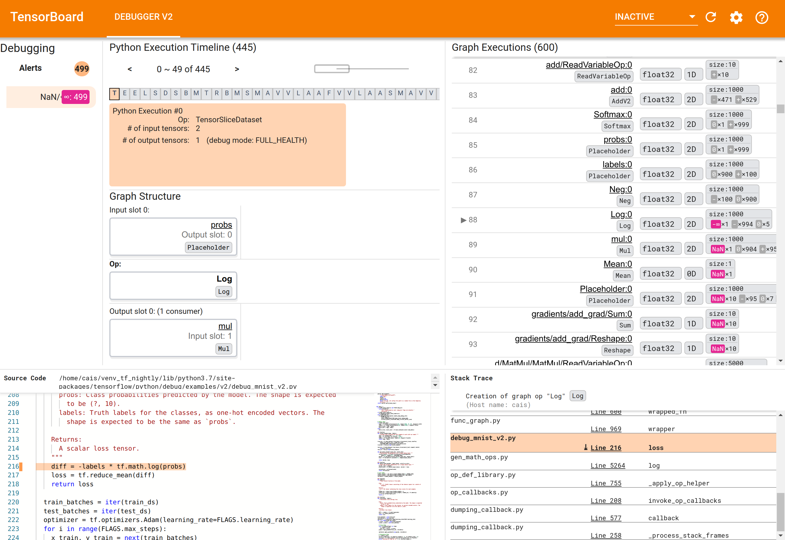
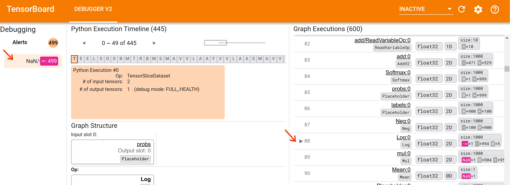
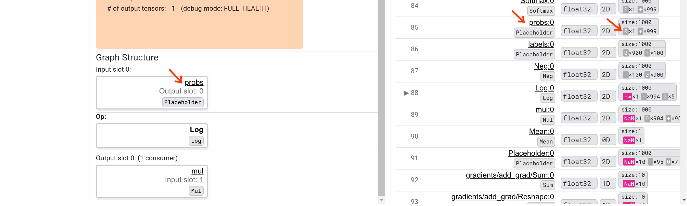
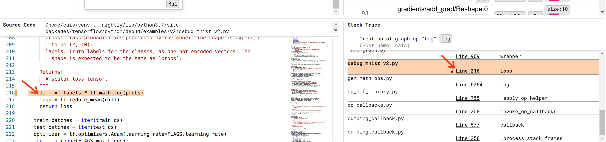

# Debugging Numerical Issues in TensorFlow Programs Using TensorBoard Debugger V2

> *NOTE*: tf.debugging.experimental.enable_dump_debug_info() is an experimental
> API and may be subject to breaking changes in the future.

Catastrophic events involving [NaN](https://en.wikipedia.org/wiki/NaN)s can
sometimes occur during a TensorFlow program, crippling the model training
processes. The root cause of such events are often obscure, especially for
models of non-trivial size and complexity. To make it easier to debug this type
of model bugs, TensorBoard 2.3+ (together with TensorFlow 2.3+) provides a
specialized dashboard called Debugger V2. Here we demonstrate how to use this
tool by working through a real bug involving NaNs in a neural network written in
TensorFlow.

The techniques illustrated in this tutorial are applicable to other types of
debugging activities such as inspecting runtime tensor shapes in complex
programs. This tutorial focuses on NaNs due to their relatively high frequency
of occurrence.

## Observing the bug

The source code of the TF2 program we’ll debug is
[available on GitHub](https://github.com/tensorflow/tensorflow/blob/master/tensorflow/python/debug/examples/v2/debug_mnist_v2.py).
The example program is also packaged into the tensorflow pip package (version
2.3+) and can be invoked by:

```sh
python -m tensorflow.python.debug.examples.v2.debug_mnist_v2
```

This TF2 program creates a multi-layer perception (MLP) and trains it to
recognize [MNIST](https://en.wikipedia.org/wiki/MNIST_database) images. This
example purposefully uses the low-level API of TF2 to define custom layer
constructs, loss function, and training loop, because the likelihood of NaN bugs
is higher when we use this more flexible but more error-prone API than when we
use the easier-to-use but slightly less flexible high-level APIs such as
[tf.keras](https://www.tensorflow.org/guide/keras).

The program prints a test accuracy after each training step. We can see in the
console that the test accuracy gets stuck at a near-chance level (~0.1) after
the first step. This is certainly not how the model training is expected to
behave: we expect the accuracy to gradually approach 1.0 (100%) as the step
increases.

```
Accuracy at step 0: 0.216
Accuracy at step 1: 0.098
Accuracy at step 2: 0.098
Accuracy at step 3: 0.098
...
```

An educated guess is that this problem is caused by a numerical instability,
such as NaN or infinity. However, how do we confirm this is really the case and
how do we find the TensorFlow operation (op) responsible for generating the
numerical instability? To answer these questions, let’s instrument the buggy
program with Debugger V2.

## Instrumenting TensorFlow code with Debugger V2

[`tf.debugging.experimental.enable_dump_debug_info()`](https://www.tensorflow.org/api_docs/python/tf/debugging/experimental/enable_dump_debug_info)
is the API entry point of Debugger V2. It instruments a TF2 program with a
single line of code. For instance, adding the following line near the beginning
of the program will cause debug information to be written to the log directory
(logdir) at /tmp/tfdbg2_logdir. The debug information covers various aspects of
TensorFlow runtime. In TF2, it includes the full history of eager execution,
graph building performed by
[@tf.function](https://www.tensorflow.org/api_docs/python/tf/function),
the execution of the graphs, the tensor values generated by the execution
events, as well as the code location (Python stack traces) of those events. The
richness of the debug information enables users to narrow in on obscure bugs.

```py
tf.debugging.experimental.enable_dump_debug_info(
    "/tmp/tfdbg2_logdir",
    tensor_debug_mode="FULL_HEALTH",
    circular_buffer_size=-1)
```

The `tensor_debug_mode` argument controls what information Debugger V2 extracts
from each eager or in-graph tensor. “FULL_HEALTH” is a mode that captures the
following information about each floating-type tensor (e.g., the commonly-seen
float32 and the less common
[bfloat16](https://en.wikipedia.org/wiki/Bfloat16_floating-point_format) dtype):
- DType
- Rank
- Total number of elements
-  A breakdown of the floating-type elements into the following categories:
   negative finite (`-`), zero (`0`), positive finite (`+`), negative infinity
   (`-∞`), positive infinity (`+∞`), and `NaN`.

The “FULL_HEALTH” mode is suitable for debugging bugs involving NaN and infinity.
See below for other supported `tensor_debug_mode`s.

The `circular_buffer_size` argument controls how many tensor events are saved to
the logdir. It defaults to 1000, which causes only the last 1000 tensors before
the end of the instrumented TF2 program to be saved to disk. This default
behavior reduces debugger overhead by sacrificing debug-data completeness. If
the completeness is preferred, as in this case, we can disable the circular
buffer by setting the argument to a negative value (e.g., -1 here).

The debug_mnist_v2 example invokes `enable_dump_debug_info()` by passing
command-line flags to it. To run our problematic TF2 program again with this
debugging instrumentation enabled, do:

```sh
python -m tensorflow.python.debug.examples.v2.debug_mnist_v2 \
    --dump_dir /tmp/tfdbg2_logdir --dump_tensor_debug_mode FULL_HEALTH
```

## Starting the Debugger V2 GUI in TensorBoard

Running the program with the debugger instrumentation creates a logdir at
/tmp/tfdbg2_logdir. We can start TensorBoard and point it at the logdir with:

```sh
tensorboard --logdir /tmp/tfdbg2_logdir
```

In the web browser, navigate to TensorBoard’s page at http://localhost:6006. The
“Debugger V2” plugin will be inactive by default, so select it from the
“Inactive plugins” menu at top right. Once selected, it should look like the
following:



## Using Debugger V2 GUI to find the root cause of NaNs

The Debugger V2 GUI in TensorBoard is organized into six sections:
- **Alerts**: This top-left section contains a list of “alert” events detected
  by the debugger in the debug data from the instrumented TensorFlow
  program. Each alert indicates a certain anomaly that warrants attention. In
  our case, this section highlights 499 NaN/∞ events with a salient pink-red
  color. This confirms our suspicion that the model fails to learn because of
  the presence of NaNs and/or infinities in its internal tensor values. We’ll
  delve into these alerts shortly.
- **Python Execution Timeline**: This is the upper half of the top-middle
  section. It presents the full history of the eager execution of ops and
  graphs. Each box of the timeline is marked by the initial letter of the op or
  graph’s name (e.g., “T” for the “TensorSliceDataset” op, “m” for the “model”
  `tf.function`). We can navigate this timeline by using the navigation buttons
  and the scrollbar above the timeline.
- **Graph Execution** : Located at the top-right corner of the GUI, this section
  will be central to our debugging task. It contains a history of all the
  floating-dtype tensors computed inside graphs (i.e., compiled by
  `@tf-function`s).
- **Graph Structure** (bottom half of the top-middle section), **Source Code**
  (bottom-left section), and **Stack Trace** (bottom-right section) are
  initially empty. Their contents will be populated when we interact with the
  GUI. These three sections will also play important roles in our debugging
  task.

Having oriented ourselves to the organization of the UI, let’s take the
following steps to get to the bottom of why the NaNs appeared. First, click the
**NaN/∞** alert in the Alerts section. This automatically scrolls the list of
600 graph tensors in the Graph Execution section and focuses on the #88, which
is a tensor named `Log:0` generated by a `Log` (natural logarithm) op. A salient
pink-red color highlights a -∞ element among the 1000 elements of the 2D float32
tensor. This is the first tensor in the TF2 program’s runtime history that
contained any NaN or infinity: tensors computed before it do not contain NaN or
∞; many (in fact, most) tensors computed afterwards contain NaNs. We can confirm
this by scrolling up and down the Graph Execution list. This observation
provides a strong hint that the `Log` op is the source of the numerical
instability in this TF2 program.



Why does this `Log` op spit out a -∞? Answering that question requires examining
the input to the op. Clicking on the name of the tensor (`Log:0`) brings up a
simple but informative visualization of the `Log` op’s vicinity in its
TensorFlow graph in the Graph Structure section. Note the top-to-bottom
direction of information flow. The op itself is shown in the bold in the middle.
Immediately above it, we can see a Placeholder op provides the one and only input
to the `Log` op. Where is the tensor generated by this `probs` Placeholder in the
Graph Execution list? By using the yellow background color as a visual aid,
we can see that the `probs:0` tensor is three rows above the `Log:0` tensor,
that is, in row 85.



A more careful look at the numerical breakdown of the `probs:0` tensor in row
85 reveals why its consumer `Log:0` produces a -∞: Among the 1000 elements of
`probs:0`, one element has a value of 0. The -∞ is a result of computing the
natural logarithm of 0! If we can somehow ensure that the `Log` op gets exposed to
only positive inputs, we’ll be able to prevent the NaN/∞ from happening. This
can be achieved by applying clipping (e.g., by using
[`tf.clip_by_value()`](https://www.tensorflow.org/api_docs/python/tf/clip_by_value))
on the Placeholder `probs` tensor.

We are getting closer to solving the bug, but not quite done yet. In order to
apply the fix, we need to know where in the Python source code the `Log` op and
its Placeholder input originated. Debugger V2 provides first-class support for
tracing the graph ops and execution events to their source. When we clicked the
`Log:0` tensor in Graph Executions, the Stack Trace section was populated with
the original stack trace of the `Log` op’s creation. The stack trace is somewhat
large because it includes many frames from TensorFlow’s internal code (e.g.,
gen_math_ops.py and dumping_callback.py), which we can safely ignore for most
debugging tasks. The frame of interest is Line 216 of debug_mnist_v2.py (i.e,
the Python file we’re actually trying to debug). Clicking “Line 216” brings up
a view of the corresponding line of code in the Source Code section.



This finally brings us to the source code that created the problematic `Log` op
from its `probs` input. This is our custom categorical cross-entropy loss
function decorated with `@tf.function` and hence converted into a TensorFlow
graph. The Placeholder op `probs` corresponds to the first input argument to
the loss function. The `Log` op is created with the tf.math.log() API call.

The value-clipping fix to this bug will look something like:

```py
  diff = -(labels *
           tf.math.log(tf.clip_by_value(probs), 1e-6, 1.))
```

It will resolve the numerical instability in this TF2 program and cause the MLP
to train successfully. Another possible approach to fixing the numerical
instability is to use
[`tf.keras.losses.CategoricalCrossentropy`](https://www.tensorflow.org/api_docs/python/tf/keras/losses/CategoricalCrossentropy).

This concludes our journey from observing a TF2 model bug to coming up with a
code change that fixes the bug, aided by the Debugger V2 tool, which provides
full visibility into the eager and graph execution history of the instrumented
TF2 program, including the numerical summaries of tensor values and association
between ops, tensors and their original source code.

## Hardware compatibility of Debugger V2

Debugger V2 supports mainstream training hardware including CPU and GPU.
Multi-GPU training with
[tf.distributed.MirroredStrategy](https://www.tensorflow.org/api_docs/python/tf/distribute/MirroredStrategy)
is also supported. The support for [TPU](https://www.tensorflow.org/guide/tpu)
is still in an early stage and requires calling

```py
tf.config.set_soft_device_placement(True)
```

before calling `enable_dump_debug_info()`. It may have other limitations on TPUs
as well. If you run into problems using Debugger V2, please report bugs on our
[GitHub issues page](https://github.com/tensorflow/tensorboard/issues).

## API compatibility of Debugger V2

Debugger V2 is implemented at a relatively low level of TensorFlow’s
software stack, and hence is compatible with
[tf.keras](https://www.tensorflow.org/api_docs/python/tf/keras),
[tf.data](https://www.tensorflow.org/guide/data), and other APIs built on top of
TensorFlow’s lower levels. Debugger V2 is also backward compatible with TF1,
although the Eager Execution Timeline will be empty for the debug logdirs
generated by TF1 programs.

## API usage tips

A frequently-asked question about this debugging API is where in the TensorFlow
code one should insert the call to `enable_dump_debug_info()`. Typically, the
API should be called as early as possible in your TF2 program, preferably after
the Python import lines and before graph building and execution begin. This will
ensure full coverage of all the ops and graphs that power your model and its
training.

The currently supported tensor_debug_modes are: `NO_TENSOR`, `CURT_HEALTH`,
`CONCISE_HEALTH`, `FULL_HEALTH`, and `SHAPE`. They vary in the amount of
information extracted from each tensor and the performance overhead to the
debugged program. Please refer to the
[args section](https://www.tensorflow.org/api_docs/python/tf/debugging/experimental/enable_dump_debug_info)
of `enable_dump_debug_info()`’s documentation.

## Performance overhead

The debugging API introduces performance overhead to the instrumented TensorFlow
program. The overhead varies by `tensor_debug_mode`, hardware type, and nature
of the instrumented TensorFlow program. As a reference point, on a GPU, the
`NO_TENSOR` mode adds a 15% overhead during the training of a
[Transformer model](https://github.com/tensorflow/models/tree/master/official/legacy/transformer)
under batch size 64. The percent overhead for other tensor_debug_modes are
higher: approximately 50% for the `CURT_HEALTH`, `CONCISE_HEALTH`, `FULL_HEALTH`
and `SHAPE` modes. On CPUs, the overhead is slightly lower. On TPUs, the
overhead is currently higher.

## Relation to other TensorFlow debugging APIs

Note that TensorFlow offers other tools and APIs for debugging. You can browse
such APIs under the
[`tf.debugging.*` namespace](https://www.tensorflow.org/api_docs/python/tf/debugging)
at the API docs page. Among these APIs the most frequently used is
[`tf.print()`](https://www.tensorflow.org/api_docs/python/tf/print).
When should one use Debugger V2 and when should `tf.print()` be used instead?
`tf.print()` is convenient in case where
1. we know exactly which tensors to print,
2. we know where exactly in the source code to insert those `tf.print()`
   statements,
3. the number of such tensors is not too large.

For other cases (e.g., examining many tensor values, examining tensor values
generated by TensorFlow’s internal code, and searching for the origin of
numerical instability as we showed above), Debugger V2 provides a faster way
of debugging. In addition, Debugger V2 provides a unified approach to inspecting
eager and graph tensors. It additionally provides information about graph
structure and code locations, which are beyond the capability of `tf.print()`.

Another API that can be used to debug issues involving ∞ and NaN is
[`tf.debugging.enable_check_numerics()`](https://www.tensorflow.org/api_docs/python/tf/debugging/enable_check_numerics).
Unlike `enable_dump_debug_info()`, `enable_check_numerics()` does not save debug
information on the disk. Instead, it merely monitors ∞ and NaN during
TensorFlow runtime and errors out with the origin code location as soon as any
op generates such bad numerical values. It has a lower performance overhead
compared to `enable_dump_debug_info()`, but doesn’t afford a full trace of the
program’s execution history and does not come with a graphical user interface
like Debugger V2.
