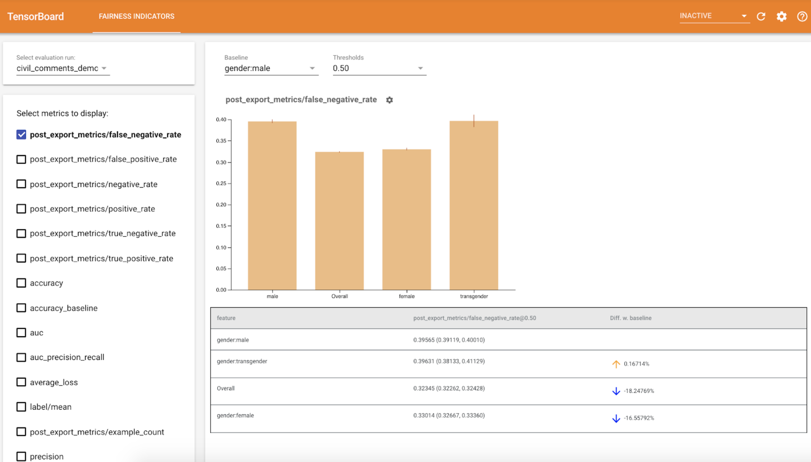

# Evaluating Models with the Fairness Indicators Dashboard [Beta]



Fairness Indicators for TensorBoard enables easy computation of
commonly-identified fairness metrics for _binary_ and _multiclass_ classifiers.
With the plugin, you can visualize fairness evaluations for your runs and easily
compare performance across groups.

In particular, Fairness Indicators for TensorBoard allows you to evaluate and
visualize model performance, sliced across defined groups of users. Feel
confident about your results with confidence intervals and evaluations at
multiple thresholds.

Many existing tools for evaluating fairness concerns don’t work well on large
scale datasets and models. At Google, it is important for us to have tools that
can work on billion-user systems. Fairness Indicators will allow you to evaluate
across any size of use case, in the TensorBoard environment or in
[Colab](https://github.com/tensorflow/fairness-indicators).

## Requirements

To install Fairness Indicators for TensorBoard, run:

```
python3 -m virtualenv ~/tensorboard_demo
source ~/tensorboard_demo/bin/activate
pip install --upgrade pip
pip install fairness_indicators
pip install tensorboard-plugin-fairness-indicators
```

## Demo

If you want to test out Fairness Indicators in TensorBoard, you can download
sample TensorFlow Model Analysis evaluation results (eval_config.json, metrics
and plots files) and a `demo.py` utility from Google Cloud Platform,
[here](https://console.cloud.google.com/storage/browser/tensorboard_plugin_fairness_indicators/)
using following command.
```
pip install gsutil
gsutil cp -r gs://tensorboard_plugin_fairness_indicators/ .
```

Navigate to directory containing downloaded files.
```
cd tensorboard_plugin_fairness_indicators
```

This evaluation data is based on the
[Civil Comments dataset](https://www.kaggle.com/c/jigsaw-unintended-bias-in-toxicity-classification),
calculated using Tensorflow Model Analysis's
[model_eval_lib](https://github.com/tensorflow/model-analysis/blob/master/tensorflow_model_analysis/api/model_eval_lib.py)
library. It also contains a sample TensorBoard summary data file for reference.


The `demo.py` utility writes a TensorBoard summary data file, which will be read
by TensorBoard to render the Fairness Indicators dashboard (See the
[TensorBoard tutorial](https://github.com/tensorflow/tensorboard/blob/master/README.md)
for more information on summary data files).

Flags to be used with the `demo.py` utility:

-   `--logdir`: Directory where TensorBoard will write the summary
-   `--eval_result_output_dir`: Directory containing evaluation results
    evaluated by TFMA (downloaded in last step)

Run the `demo.py` utility to write the summary results in the log directory:

`python demo.py --logdir=. --eval_result_output_dir=.`

Run TensorBoard:

Note: For this demo, please run TensorBoard from the same directory containing
all the downloaded files.

`tensorboard --logdir=.`

This will start a local instance. After the local instance is started, a link
will be displayed to the terminal. Open the link in your browser to view the
Fairness Indicators dashboard.

### Demo Colab

[Fairness_Indicators_TensorBoard_Plugin_Example_Colab.ipynb](https://github.com/tensorflow/fairness-indicators/blob/master/g3doc/tutorials/Fairness_Indicators_TensorBoard_Plugin_Example_Colab.ipynb)
contains an end-to-end demo to train and evaluate a model and visualize fairness evaluation
results in TensorBoard.

## Usage

To use the Fairness Indicators with your own data and evaluations:

1.  Train a new model and evaluate using
    `tensorflow_model_analysis.run_model_analysis` or
    `tensorflow_model_analysis.ExtractEvaluateAndWriteResult` API in
    [model_eval_lib](https://github.com/tensorflow/model-analysis/blob/master/tensorflow_model_analysis/api/model_eval_lib.py).
    For code snippets on how to do this, see the Fairness Indicators colab
    [here](https://github.com/tensorflow/fairness-indicators).

2.  Write Fairness Indicators Summary using `tensorboard_plugin_fairness_indicators.summary_v2` API.

    ```
    writer = tf.summary.create_file_writer(<logdir>)
    with writer.as_default():
        summary_v2.FairnessIndicators(<eval_result_dir>, step=1)
    writer.close()
    ```

3.  Run TensorBoard

    -   `tensorboard --logdir=<logdir>`
    -   Select the new evaluation run using the drop-down on the left side of
        the dashboard to visualize results.
