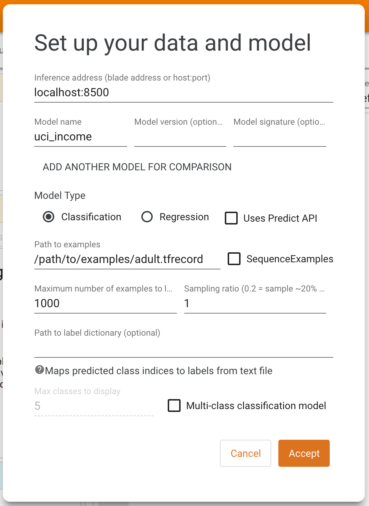

# Model Understanding with the What-If Tool Dashboard

The What-If Tool (WIT) provides an easy-to-use interface for expanding
understanding of black-box classification and regression ML models. With the
plugin, you can perform inference on a large set of examples and immediately
visualize the results in a variety of ways. Additionally, examples can be
edited manually or programmatically and re-run through the model in order to
see the results of the changes. It contains tooling for investigating model
performance and fairness over subsets of a dataset.

The purpose of the tool is to give people a simple, intuitive, and powerful
way to explore and investigate trained ML models through a visual interface
with absolutely no code required.

The tool can be accessed through TensorBoard or directly in a Jupyter or Colab
notebook. For more in-depth details, demos, walkthroughs, and information
specific to using WIT in notebook mode, see the
[What-If Tool website](https://pair-code.github.io/what-if-tool).

## Requirements

To use WIT in TensorBoard, two things are necessary:
- The model(s) you wish to explore must be served using
  [TensorFlow Serving](https://github.com/tensorflow/serving) using the classify,
  regress, or predict API.
- The dataset to be inferred by the models must be in a TFRecord file accessible
  by the TensorBoard web server.

## Usage

When opening the What-If Tool dashboard in TensorBoard, you will see a setup
screen where you provide the host and port of the model server, the name of
the model being served, the type of model, and the path to the TFRecords file
to load. After filling this information out and clicking "Accept", WIT will
load the dataset and run inference with the model, displaying the results.

For details on the different features of WIT and how they can aid in model
understanding and fairness investigations, see the walkthrough on the
[What-If Tool website](https://pair-code.github.io/what-if-tool).

## Demo model and dataset

If you want to test out WIT in TensorBoard with a pre-trained model, you can
download and unzip a pre-trained model and dataset from
https://storage.googleapis.com/what-if-tool-resources/uci-census-demo/uci-census-demo.zip.
The model is a binary classification model that uses the
[UCI Census](https://archive.ics.uci.edu/ml/datasets/census+income) dataset
to predict whether a person earns more than $50k a year. This dataset and
prediction task is often used in machine learning modeling and fairness
research.

Set the environment variable MODEL_PATH to the location of the resulting model
directory on your machine.

Install docker and TensorFlow Serving following the
[official documentation](https://www.tensorflow.org/serving/docker).

Serve the model using docker through
`docker run -p 8500:8500 --mount type=bind,source=${MODEL_PATH},target=/models/uci_income -e MODEL_NAME=uci_income -t tensorflow/serving`.
Note you may need to run the command with `sudo` depending on your docker
setup.

Now launch tensorboard and use the dashboard drop-down to navigate to the
What-If Tool.

On the setup screen, set the inference adddress to "localhost:8500", the
model name to "uci_income" and the path to examples to the full path to the
downloaded `adult.tfrecord` file, then press "Accept".

Some things to try with the What-If Tool on this demo include:
- Editing a single datapoint and seeing the resulting change in inference.
- Exploring the relationship between individual features in the dataset and
  the model's inference results through partial dependence plots.
- Slicing the dataset into subsets and comparing the performance between
  slices.

For an in-depth look at tool's features, check out the
[What-If Tool walkthrough](https://pair-code.github.io/what-if-tool/walkthrough.html).

Note the ground truth feature in the dataset that this model is trying to
predict is named "Target", so when using the "Performance & Fairness" tab,
"Target" is what you will want to specify in the ground truth feature dropdown.
