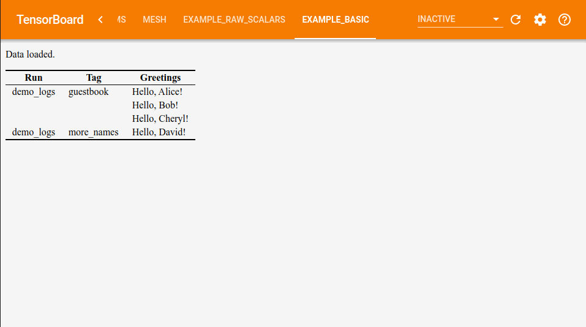

# Basic example TensorBoard plugin

## Overview

In this example, we define a custom summary op `greeting(name, guest)`, use it to write values from Python, and surface the data in TensorBoard's frontend. For a complete guide to plugin development, see [`ADDING_A_PLUGIN`](../../../../ADDING_A_PLUGIN.md).



## Running the example

Generate some sample Greeting summaries by running [`demo.py`][demo_py]. Alternatively, to write Greetings from your own Python program, import [`summary_v2.py`][summary_v2_py], create a summary file writer, and call `summary_v2.greeting("very important people", "you", step)`.

[demo_py]: tensorboard_plugin_example/demo.py
[summary_v2_py]: tensorboard_plugin_example/summary_v2.py

Copy the directory `tensorboard/examples/plugins/example_basic` into a desired folder. In a virtualenv with TensorBoard installed, run:

```
python setup.py develop
```

This will link the plugin into your virtualenv. Then, just run

```
tensorboard --logdir /tmp/runs_containing_greetings
```

and open TensorBoard to the basic example tab.

After making changes to the Python code, you must restart TensorBoard for your changes to take effect. The example plugin serves web assets at runtime, so changes reflected upon reloading the page.

To uninstall, you can run

```
python setup.py develop --uninstall
```

to unlink the plugin from your virtualenv, after which you can also delete the `tensorboard_plugin_example.egg-info/` directory that the original `setup.py` invocation created.
