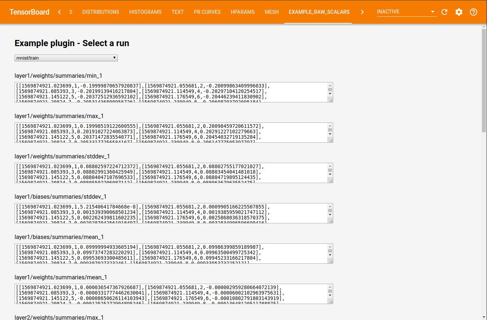

# Raw scalars example TensorBoard plugin

## Overview

In this example, we render a run selector dropdown component. When the user selects a run, it shows a preview of all scalar data for tags within it. For a complete guide to plugin development, see [ADDING_A_PLUGIN](../../../../ADDING_A_PLUGIN.md).



All files under [`static/*`][static-dir] are served as static assets, with the frontend entry point being [`static/index.js`][static-index-js]. The plugin backend serves scalar summaries (e.g. values written by [`tf.summary.scalar`][summary_scalar_docs]) from runs within the `--logdir` passed to TensorBoard.

[static-dir]: ./tensorboard_plugin_example_raw_scalars/static
[static-index-js]: ./tensorboard_plugin_example_raw_scalars/static/index.js
[basic-example-docs]: https://github.com/tensorflow/tensorboard/blob/master/tensorboard/examples/plugins/example_basic/README.md

## Getting started

To generate some scalar summaries, you can run the [`demo.py`](tensorboard_plugin_example/demo.py). Alternatively, you can write scalars from your own Python program to a log directory, using [Keras callbacks][keras_scalars_tutorial] or [`tf.summary.scalar`][summary_scalar_docs] with a summary file writer.

[summary_scalar_docs]: https://www.tensorflow.org/api_docs/python/tf/summary
[keras_scalars_tutorial]: https://www.tensorflow.org/tensorboard/scalars_and_keras

Copy the directory `tensorboard/examples/plugins/example_raw_scalars` into a desired folder. In a virtualenv with TensorBoard installed, run:

```
python setup.py develop
```

This will link the plugin into your virtualenv. Then, just run

```
tensorboard --logdir /tmp/runs_containing_scalars
```

and open TensorBoard to see the raw scalars example tab.

After making changes to [`static/index.js`](./tensorboard_plugin_example_raw_scalars/static/index.js) or adding assets to `static/`, you can refresh the page in your browser to see your changes. Modifying the backend requires restarting the TensorBoard process.

To uninstall, you can run

```
python setup.py develop --uninstall
```

to unlink the plugin from your virtualenv, after which you can also delete the `tensorboard_plugin_example_raw_scalars.egg-info/` directory that the original `setup.py` invocation created.
