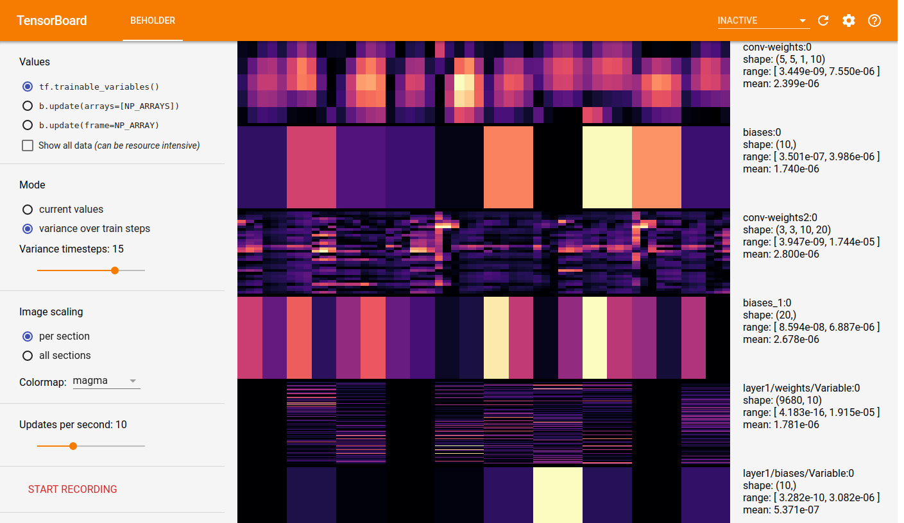
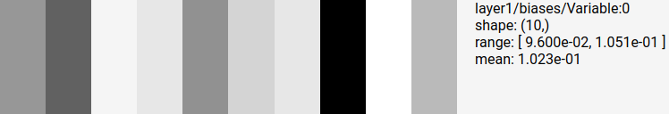
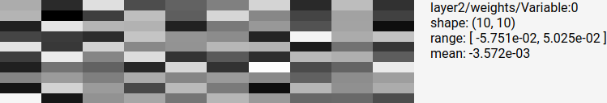
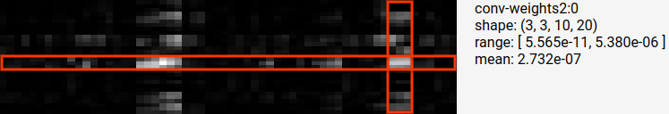
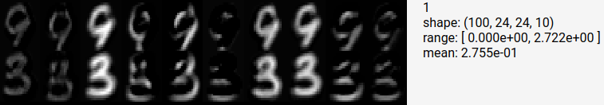
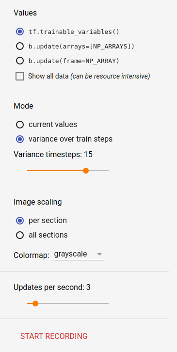

# The Beholder Plugin

The Beholder plugin shows a live video feed of tensor data in TensorBoard during
model training. It can display model variable values, arbitrary NumPy arrays
(e.g. for gradients or activations), or pre-existing image frames.

For now, Beholder should be considered a **beta release**.

Beholder was originally developed by [Chris Anderson][chrisranderson], who also
created this [demo video for Beholder][demo-video].

[chrisranderson]: https://github.com/chrisranderson
[demo-video]: https://www.youtube.com/watch?v=06HjEr0OX5k



## Instrumenting a Model

To use Beholder, import and instantiate the `Beholder` class in your model code
and from the training loop call the `update` method with a `Session` argument:

```python
from tensorboard.plugins.beholder import Beholder
beholder = Beholder(LOG_DIRECTORY)

# inside train loop
beholder.update(
  session=sess,
  arrays=list_of_np_ndarrays,  # optional argument
  frame=np_ndarray,  # optional argument
)
```

By default, Beholder will visualize `tf.trainable_variables()`, but two optional
arguments can provide additional data sources for visualization:

- `arrays`: a list of NumPy `ndarray` values, interpreted as described below

- `frame`: an `ndarray` of shape `[height, width, channels]` for direct display
  via [`tf.image.encode_png`][encode-png] (if omitted, `channels` is set to 1),
  or a function that returns such an array (to skip generation if not displayed)

[encode-png]: https://www.tensorflow.org/api_docs/python/tf/image/encode_png

For code using `tf.train.MonitoredSession`, there's also `BeholderHook`:

```python
from tensorboard.plugins.beholder import BeholderHook
beholder_hook = BeholderHook(LOG_DIRECTORY)
with MonitoredSession(..., hooks=[beholder_hook]) as sess:
  sess.run(train_op)
```

## The Beholder Dashboard

Launch TensorBoard pointing at the same directory (e.g `--logdir LOG_DIRECTORY`)
and select the "Beholder" tab.

### Data Visualization

Beholder's primary feature is visualizing arbitrary NumPy arrays of data in a
single video stream. Within the stream, horizontal "sections" represent each
array, each section consists of "blocks" of identically colored pixels, and
each block represents a single value from the original array.

The shape of the array determines how blocks are laid out and how values are
mapped to those blocks. Note that in general, large arrays are truncated by
default unless the *Show all data* option is selected or the array is "oddly
shaped" (see below for details).

#### 1D Arrays (e.g. biases)



Each block is a vertical bar representing a single array value, matching the
actual array.

#### 2D Arrays (e.g. dense layer weights)



Each block is an element of a 2D grid that matches the actual array. For dense
layer weights, this means the row of the block corresponds to the weight's input
node and the column to the output node.

#### 4D Arrays (e.g. convolution layer weights)



By default, 4D arrays are interpreted as convolution weights where the shape is
`[filter_height, filter_width, in_channels, out_channels]`. Blocks are arranged
in chunks of shape `[filter_height, filter_width]` and these chunks are in turn
arranged similar to a 2D array, where rows correspond to input channels and
columns to output channels.

The above example array has shape `[3, 3, 10, 20]` and is reshaped into 10 rows
and 20 columns of 3x3-block chunks. The superimposed highlighting indicates a
particular row and column, which intersect at a high-valued 3x3 chunk.

If the array shape "looks like" a 4D activation instead (first two dimensions
differ, but the middle two match) then the array shape is interpreted instead
as `[batch_size, height, width, channels]`. Blocks are arranged in chunks of
shape `[height, width]` and these chunks are arranged in a 2D array where rows
correspond to batch elements and columns correspond to output channels.



The above example array has shape `[100, 24, 24, 10]` and is reshaped into
100 rows (truncated to 2 for display; to show all, use the *Show all data*
option) and 10 columns of 24x24-block chunks.

### Control Panel

Various controls for adjusting the visualization are available in a left-hand
control panel. Setting choices are persisted to the log directory.



- Values
  - Input source: allows switching input source as described above
  - Show all data: avoids truncating any arrays, but may be resource intensive
- Mode
  - Current values: show the latest array values
  - Variance over train steps: show the variance over the past N steps, where N
    is controlled by the slider that appears when this option is selected
- Image scaling
  - Per section: color range is scaled separately for each section
  - All sections: color range is scaled across data from all sections
  - Colormap: dropdown to choose what colormap to use for displaying data - dark
    colors are low values and bright colors are high values
- Updates per second
  - Sets the maximum frequency for computing the visualization video for the
    current input source; if the train loop is slower than this, new frames will
    only be displayed when available. Set to 0 to "pause" on the current frame,
    and to avoid unnecessary overhead in the model when not actively viewing.
- Recording
  - Button to start/stop recording the current video feed to disk. See below for
    details.

### Recordings

Video recordings are saved under the `<logdir>/plugins/beholder` directory. If
FFmpeg is installed, Beholder will use it to generate a .webm VP9-encoded video,
with playback at 15 frames per second. Otherwise, it will save individual PNG
frames within a subdirectory. Changing the video frame shape (e.g. by changing
input sources, or emitting `frame` values of different sizes) will automatically
start a new recording.

# Limitations and Known Issues

Beholder has the following limitations and known issues.

* Beholder requires write access to the log directory (specifically, to the
  `$LOGDIR/plugins/beholder` subdirectory) in order to pass config and
  visualization parameters to the running code.  If the config file location
  is not writable, the UI controls will be disabled.

* Beholder currently only works well on local file systems.
