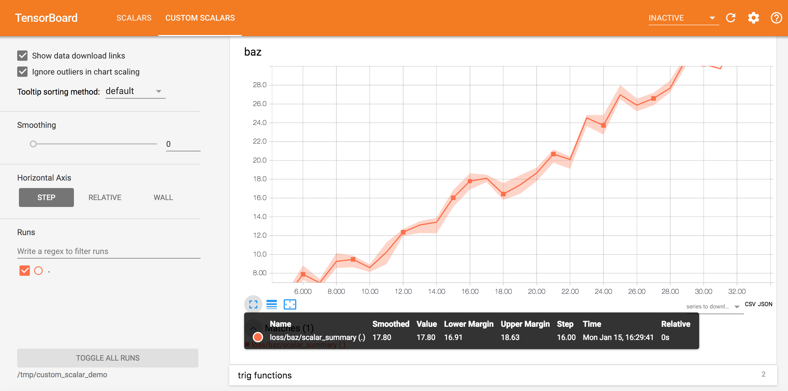
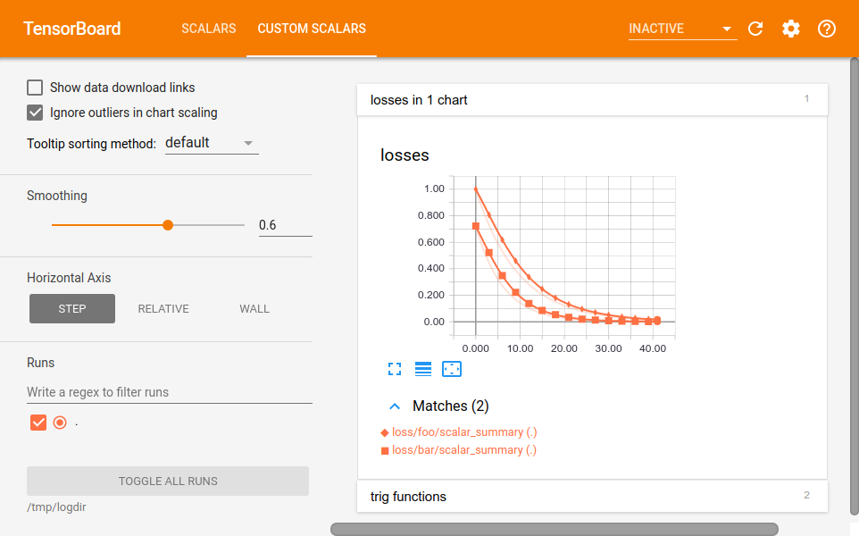
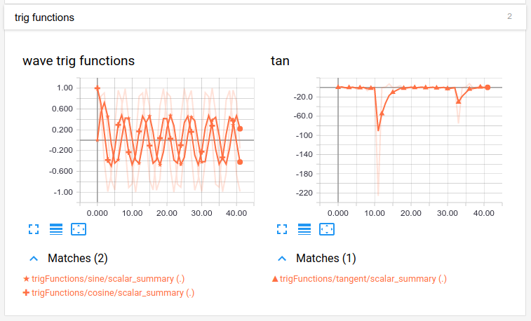
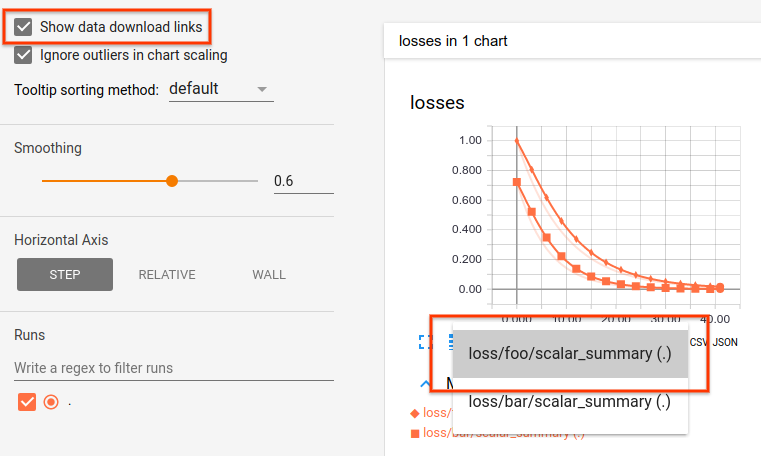

# The Custom Scalar Dashboard

## Overview

In turn, the *custom* scalar dashboard lets users

1. Create line charts with custom combinations of runs and tags by assigning
each chart a list of regular expressions for tags.
2. Lay out the dashboard in a customized way.

To use this dashboard, users first collect scalar data and then lay out the UI.



## The Problem this Dashboard Solves

The (original) scalar dashboard shows line charts for data collected from scalar
summaries: Each line chart visualizes data for 1 tag, and tags are automatically
organized into categories based on how tags are prefixed.

Hence, during data collection (adding summaries to the model), some users might
be compelled to construct tag strings in ways that codge the scalar dashboard to
render in desirable layouts. This is suboptimal: The display of data is coupled
with the collection of data.

For instance, a user might introduce 2 tags (say `rms/foo` and `rms/bar`) that
each pertain to loss for different models. The scalar dashboard introduces 1
chart for each tag, making it harder to compare loss for the 2 models.

In addition, some users desire to organize the dashboard in ways that differ
from the default. For instance, some users would like to quickly see charts for
certain loss functions above the fold of the viewport.

### Collecting Scalar Data

As expected, users first
[collect scalar data with summaries](https://www.tensorflow.org/get_started/summaries_and_tensorboard).
For example:

```python
from tensorboard import summary as summary_lib
...
loss = tf.losses.softmax_cross_entropy(
    onehot_labels=tf.one_hot(labels, depth=num_classes),
    logits=logits,
    weights=weights)
summary_lib.scalar('cross_entropy', loss)
```

Some code might use `tf.summary.scalar` from the *TensorFlow* library in lieu of
`summary_lib.scalar`. That works as well and will continue to be supported by
TensorBoard.

### Specifying a Layout

To lay out the dashboard, users pass a `layout_pb2.Layout` proto to the
`summary_lib.custom_scalars_pb` method. This method does not return a TensorFlow
op but rather a Summary proto that be passed to the SummaryWriter (See sample
code.).

The `Layout` proto encapsulates the organization of the dashboard. See
[layout.proto](layout.proto) for documentation. See the code below for an
example of how to use it.

### Specifying a Layout via a TensorFlow op instead

A user could optionally use the `summary_lib.custom_scalars` TensorFlow op write
the layout to disk as part of executing the graph.

This is often not needed because in many cases, users need only to specify the
layout once (which also saves disk space). However, sometimes, the user may seek
to change the layout over time.

### Example Code

```python
from tensorboard import summary as summary_lib
from tensorboard.plugins.custom_scalar import layout_pb2
import tensorflow as tf

step = tf.placeholder(tf.float32, shape=[])

with tf.name_scope('loss'):
  # Specify 2 different loss values, each tagged differently.
  summary_lib.scalar('foo', tf.pow(0.9, step))
  summary_lib.scalar('bar', tf.pow(0.85, step + 2))

with tf.name_scope('trigFunctions'):
  summary_lib.scalar('cosine', tf.cos(step))
  summary_lib.scalar('sine', tf.sin(step))
  summary_lib.scalar('tangent', tf.tan(step))

merged_summary = tf.summary.merge_all()

with tf.Session() as sess, tf.summary.FileWriter('/tmp/logdir') as writer:
  # We only need to specify the layout once (instead of per step).
  summary_lib.custom_scalars_pb(layout_pb2.Layout(
    category=[
      layout_pb2.Category(
        title='losses in 1 chart',
        chart=[
            layout_pb2.Chart(
                title='losses',
                tag=[r'loss.*']),
        ]),
      layout_pb2.Category(
        title='trig functions',
        chart=[
            layout_pb2.Chart(
                title='wave trig functions',
                tag=[r'trigFunctions/cosine', r'trigFunctions/sine']),
            # The range of tangent is different. Lets give it its own chart.
            layout_pb2.Chart(
                title='tan',
                tag=[r'trigFunctions/tangent']),
        ],
        # This category we care less about. Lets make it initially closed.
        closed=True),
    ]))

  for i in xrange(42):
    summary = sess.run(merged_summary, feed_dict={step: i})
    writer.add_summary(summary, global_step=step)
```

## The Dashboard UI

The above logic produces this custom scalar dashboard.



Note that the layout mirrors the `layout_pb2.Layout` proto that we had passed to
the `summary_lib.custom_scalars_pb` method. Specifically, we have 2 categories:
(1) losses in 1 chart and (2) trig functions (which is closed by default).

Within the "losses" chart are 2 lines. They correspond to tags that had been
obtained by the regular expression `r'loss.*'`. Because the 2 tags are for the
same run, the 2 lines differ in markers (One uses squares, while the other uses
diamonds.) to be distinct from each other. Color still encodes the run.

If we expand the "trig functions" category, we find that lines for sine and
cosine are within one chart, and the line for tangent resides in a separate one
(as expected).



The left hand side of the dashboard is identical to that of the normal scalar
dashboard and should be already familiar to users of that dashboard.

For instance, users can opt to change the X-axis to say wall or relative time as
well as control how much to smooth charts.

### Downloading Data

Users can download data for a specific run-tag combination (that is, a specific
line within a chart) by turning on "Show data download links" on the left hand
side, then selecting the data series within a chart:



Formats supported include JSON and CSV. Each entry corresponds to a point in
time.
