# The Debugger Dashboard

The debugger dashboard offers a graphical user interface for the [TensorFlow debugger](https://www.tensorflow.org/programmers_guide/debugger). For instance, this dashboard enables users to

* pause and resume execution at specified nodes or numbers of steps.
* visualize values of tensors over time.
* associate tensors with specific lines in python code.

This dashboard is in its **alpha release**. Some features are not yet fully functional.

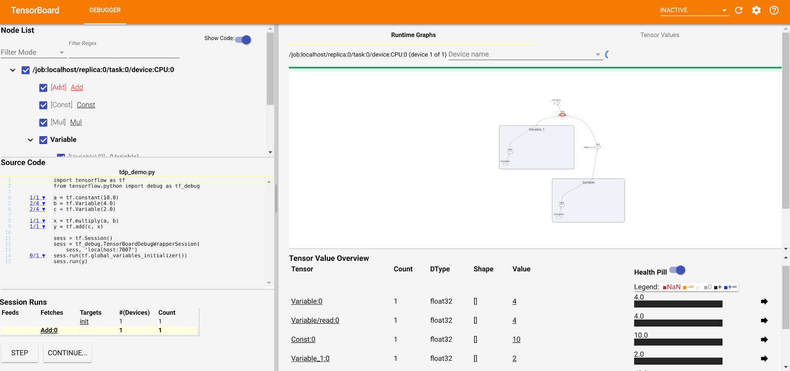

# Setup

## Start TensorBoard with the `debugger_port` flag.

To enable the debugger dashboard, pass the `debugger_port` flag to TensorBoard. TensorBoard will then both receive gRPC messages from and issue gRPC messages to model logic via this port.

This command demonstrates how to set the debugger port to 6064.

```
tensorboard \
    --logdir ~/project_foo/model_bar_logdir \
    --port 6006 \
    --debugger_port 6064
```

## Navigating to TensorBoard

Navigate to the debugger dashboard within TensorBoard based on which port it serves on (specified via the `port` flag). For instance, the URL might be `http://localhost:6006#debugger`.

Initially, a dialog may indicate that the dashboard is waiting on a session run to begin. The dialog will hide once the latter happens (when model logic executes).

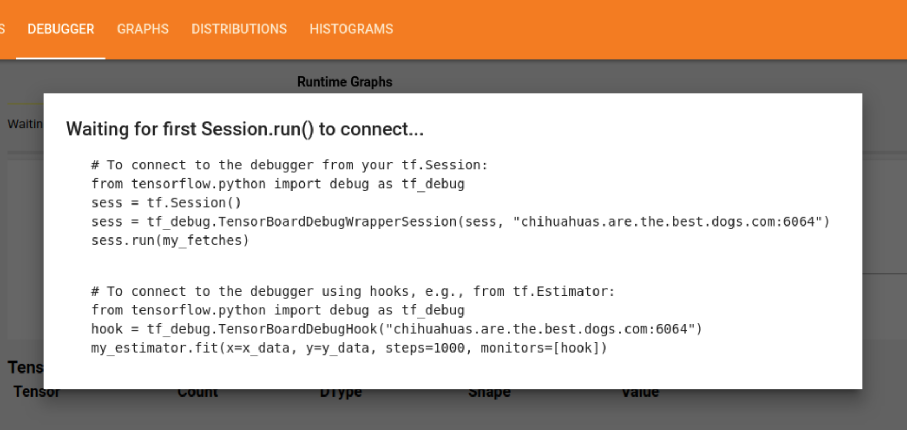

## Instrumenting Model Logic

The model must establish a 2-way gRPC connection with TensorBoard (via the debugger port specified earlier).

To do that, construct a [`TensorBoardDebugWrapperSession`](https://www.tensorflow.org/api_docs/python/tfdbg/TensorBoardDebugWrapperSession). Subsequently, that wrapper session will issue [gRPC](https://grpc.io/docs/guides/) messages to TensorBoard that contain data for debugging.

The constructor accepts these parameters.

1. the original `tf.Session` object.
2. the `[[host]]:[[port]]` address to which to stream gRPC messages.

Example logic:

```python
from tensorflow.python import debug as tf_debug
sess = tf.Session()
sess = tf_debug.TensorBoardDebugWrapperSession(sess, 'localhost:6064')
sess.run(my_fetches)
```

## Other Ways to Instrument Models

Sometimes, the TensorFlow session may not be directly accessible. For projects that use tflearn's `Estimator`s, `Experiment`s, and `MonitoredSession`s, users can instrument code with the [`TensorBoardDebugHook`](https://www.tensorflow.org/api_docs/python/tfdbg/TensorBoardDebugHook).

To debug models built atop other high-level APIs such as Keras and TF-Slim,
refer to [documentation on the TensorFlow debugger](https://www.tensorflow.org/programmers_guide/debugger).

# Selecting Nodes

After nodes in the graph are selected, the debugger dashboard will pause runs at those nodes,
enabling users to examine node outputs.

## The Node List

Nodes can be selected via the node list on the top left:

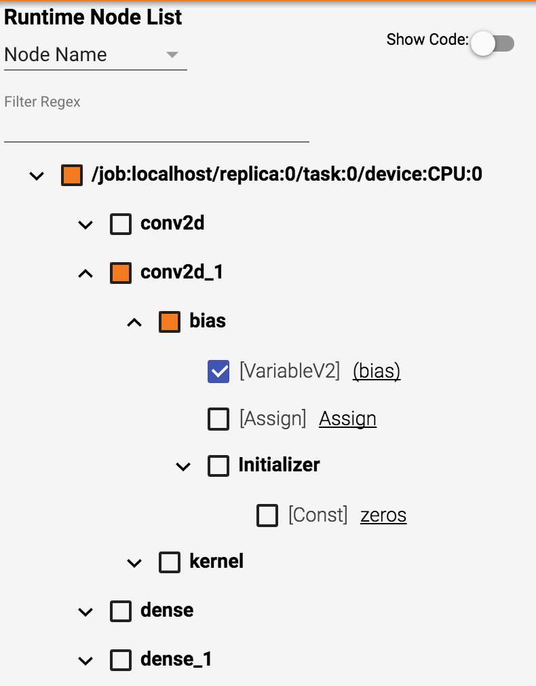

Toggling a checkbox next to an entire scope selects or deselects all nodes under the scope. The checkbox for a scope is orange if some but not all of the nodes within it are selected.

The nodes shown in the list may be filtered by
[regular expressions](https://developer.mozilla.org/en-US/docs/Web/JavaScript/Guide/Regular_Expressions)
based on node name or op type. Afterwards, nodes may be more efficiently selected by the user.

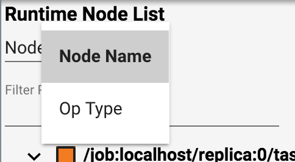

Clicking the link next to a node makes the graph explorer pan and zoom to it (and expand nodes if need be to show it):

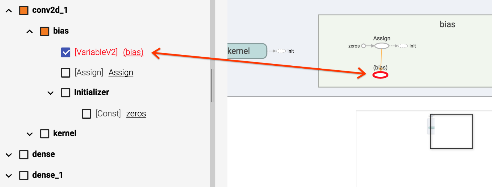

## The Graph Explorer

Runtime graphs for each device may be examined within the graph explorer (on the right side of the dashboard).

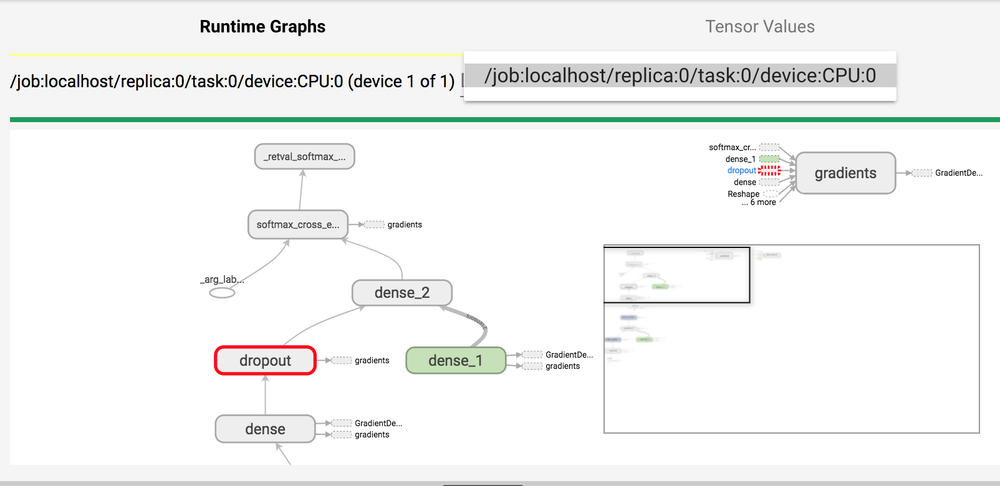

The graph explorer offers another way to select a node: **A context menu appears when a node is right-clicked.**

The user can then chose to either

1. Set a breakpoint at the node (equivalent to selecting it in the node list).
2. Continue to the node. This convenience option sets the breakpoint and then continues execution to the node.

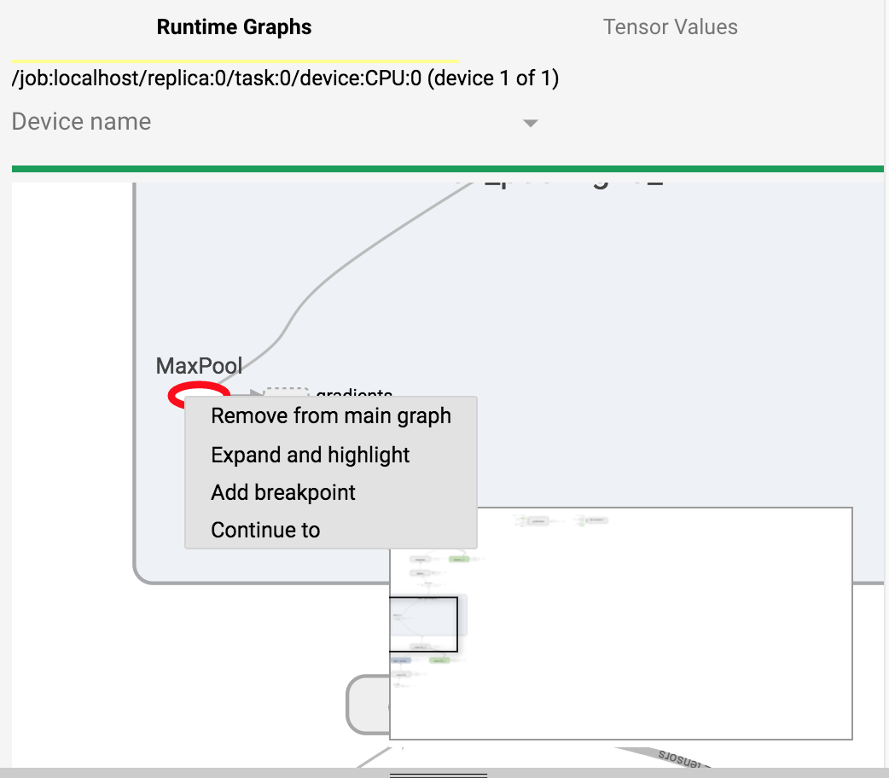

# Controlling Execution

After selecting nodes, the user can continue execution for a certain number of session runs by clicking **Continue**:

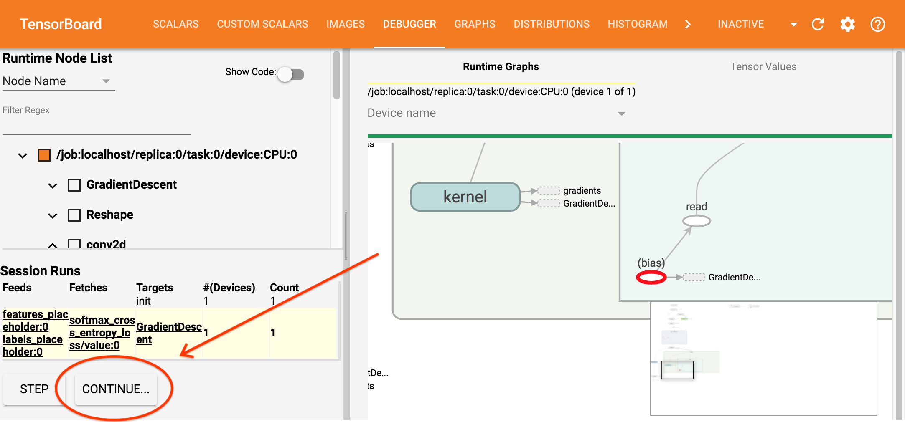

Clicking the button opens a dialog that lets the user specify how many session runs to execute. Execution will pause at breakpoints (selected nodes).

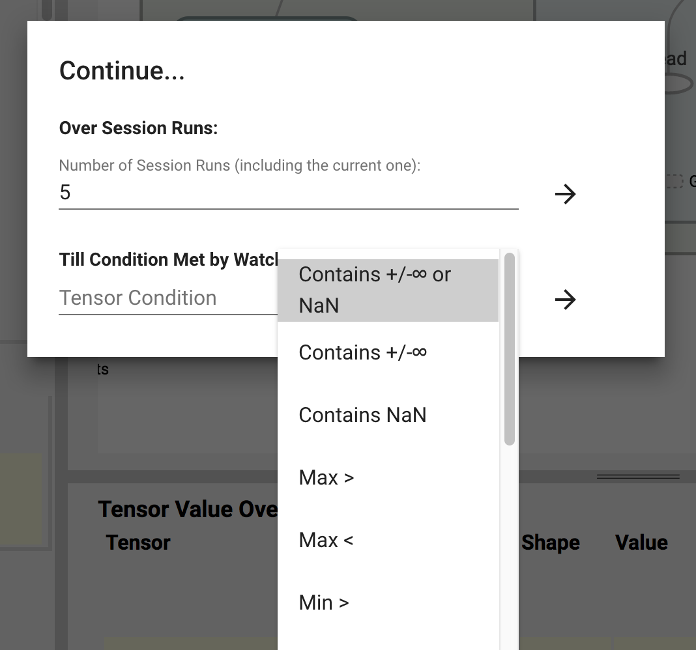

Via this dialog, the user may specify breakpoints based on conditions (in addition to the breakpoints that are based on selected nodes):

* When a tensor contains any bad ([NaN](https://en.wikipedia.org/wiki/NaN), or +/- Infinity) values.
* When a tensor contains any +/- Infinity values.
* When a tensor contains any [NaN](https://en.wikipedia.org/wiki/NaN) values.
* When the max value of a tensor exceeds some constant.
* When the max value of a tensor is below some constant.
* When the min value of a tensor exceeds some constant.
* When the min value of a tensor is below some constant.
* When the (max - min) value of a tensor exceeds some constant.
* When the (max - min) value of a tensor is below some constant.
* When the mean value of a tensor exceeds some constant.
* When the mean value of a tensor is below some constant.
* When the standard deviation of a tensor exceeds some constant.
* When the standard deviation of a tensor is below some constant.

These conditions bear much semblance to [filters of the TensorFlow debugger](https://www.tensorflow.org/programmers_guide/debugger#finding_nans_and_infs).

When execution is paused, the next node can be stepped to via clicking **Step**. If a program runs multiple sessions, they will be listed within the Session Runs table under the node list.

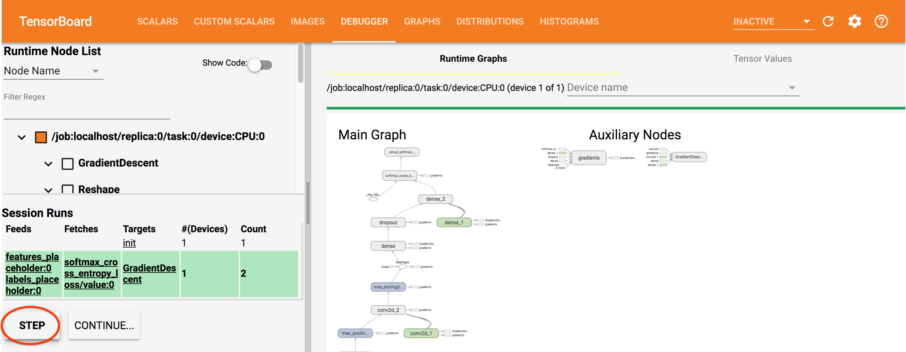

# Examining the Values of Tensors

When execution is paused, the values of output tensors for all selected nodes are shown within the tensor values table (under the graph). The current node is shown in red.

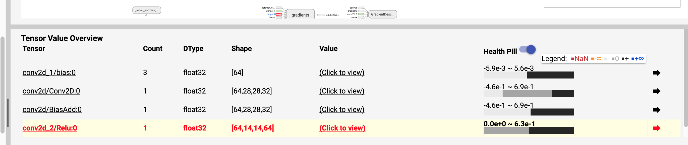

Also presented for each node are the name, count (the number of times the node has been executed), data type, and shape.

Next to each node is a **health pill**, which visualizes the proportion of values within the tensor that fall under each of the six categories noted in the legend. A user might use health pills to for instance pinpoint nodes that are culprits for producing undesired values (such as NaN).

Mousing over a health pill reveals more information about values within the tensor such as mean and standard deviation.

## Tensor Values Visualized

Note the column titled "Value". Clicking to view the value of each node adds a new card (for visualizing the tensor's value) to the Tensor Values pane.

1D tensors (such as bias in this case) are visualized with a line chart. The X axis represents the index into the tensor, while the Y axis represents the value.

Tensors with a rank of 4 are shown as images. In this example, the filter of a convolutional node is visualized. The overall contours of an MNIST digit (8) are visible.

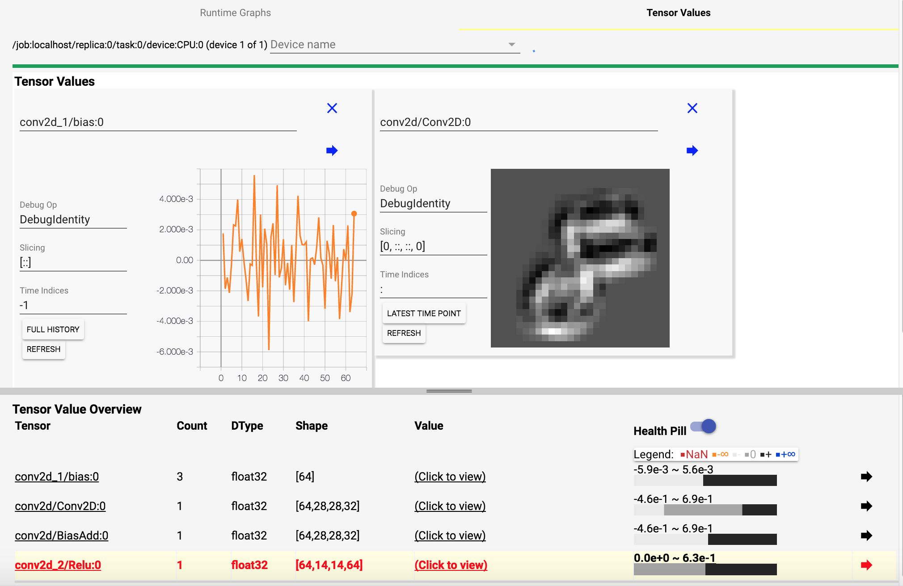

While execution occurs, visualizations within the tensor value cards update, letting the user view live output values of nodes as animations.

### Slicing Tensors

Within each card displaying a tensor value, the user can slice the tensor (via  [numpy-style slicing](https://docs.scipy.org/doc/numpy-1.13.0/reference/arrays.indexing.html)):

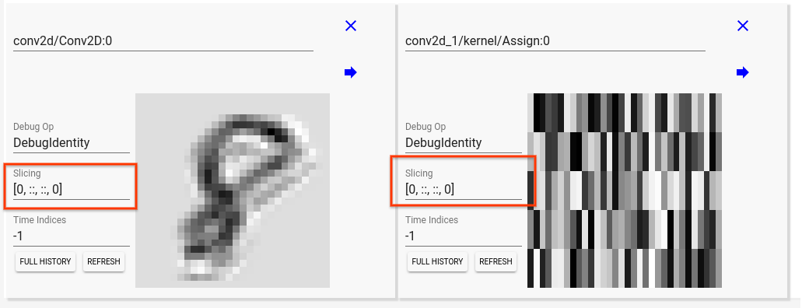

For example, suppose a tensor has a shape of (500, 100), applying a slicing of `[::5, :2]` will slice the tensor every 5 indices along the first dimension and take only the first two indices along the second dimension.

#### Slicing based on Time (Tensor Value History)

For each tensor, the time axis (history of the tensor's execution) is treated as an 1D array. Numpy-style slicing can be applied to time. For example, the default slicing of `-1` selects the most recent value. However, if the user changes that slicing parameter to `:`, the full history of the tensor will be shown (and the rank of the tensor being visualized is increased by 1).

# Frequently Asked Questions (FAQ)

## Q: How to exit debugging?

Answer: Follow these steps to interrupt your TensorFlow program being debugged
and the TensorBoard process running the debugger plugin (*in that order*):

1. Send `SIGINT` to the TensorFlow program being debugged, e.g., by using
   `Ctrl+C`.
2. Send `SIGINT` to the TensorBoard process running the debugger plugin, e.g.,
   by using `Ctrl+C`.

# Limitations and Known Issues

The debugger plugin has the following limitations and known issues. We plan to
fix them in future releases.

* The debugger plugin does not yet support multiple users debugging at once.
