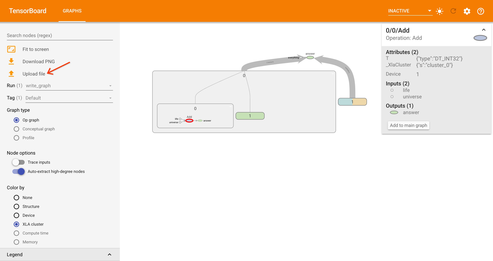

# Graph Dashboard

The Graph dashboard provides a visual representation of a computation graph,
designed for understanding ML models.

## What are graphs?

Programs written with TensorFlow and other frameworks may transform the source
code into a computational graph first, before actually executing the operations.
To illustrate the idea, this short snippet:

```
w = 2
result = sqrt(w)
```

might be represented as a graph with

-   3 nodes: w, sqrt, result
-   2 edges: [w, sqrt], [sqrt, result]

Notably, the graph itself does not contain variable values (e.g. weights),
assets, or signatures (e.g. input and output values).

### Creating a graph

For details guides on creating graphs, please see the docs for
[TensorFlow](https://www.tensorflow.org/guide/intro_to_graphs) or
[PyTorch](https://pytorch.org/docs/stable/tensorboard.html#torch.utils.tensorboard.writer.SummaryWriter.add_graph).

**Saving to an event file**

In TensorFlow 2, users annotate a Python function with the `@tf.function`
decorator to compile it into a TensorFlow graph. To save it, wrap the function
call with `tf.summary.trace_on(graph=true)` and `tf.summary.trace_export()` to
write the graph data to event files in the log directory.

```python
@tf.function
def my_func():
  return tf.random.uniform((3, 3))

writer = tf.summary.create_file_writer('logs')
tf.summary.trace_on(graph=True)

my_func()

with writer.as_default():
  tf.summary.trace_export(name="my_func", step=0)
```

In TensorFlow 1, the graph of a session is manually added with `add_graph()`.

```python
writer = tf.summary.FileWriter('logs')
with tf.Session() as sess:
  a = tf.placeholder(tf.float32, shape=(1, 2))

with writer.as_default():
  writer.add_graph(sess.graph)
```

**Saving to Protobuf text format (.pbtxt)**

When a `tf.Graph` or `tf.compat.v1.GraphDef` object is available, it can be
written directly to a file using TensorFlow's
[`tf.io.write_graph()`](https://www.tensorflow.org/api_docs/python/tf/io/write_graph),
like so:

```python
tf.io.write_graph(graph_or_graphdef, '/tmp/dir', 'my_graph.pbtxt')
```

A `@tf.function` function's graph can be accessed via
`my_func.get_concrete_function().graph`.

## Using the dashboard

Graphs can be loaded into TensorBoard by either:

-   Launching `tensorboard --logdir /dir/containing/written_graphs` at a logdir
    with event files containing a graph.
-   Launching TensorBoard, opening the "Graphs" tab, and clicking "Choose file"
    in the left sidepane to upload a *.pbtxt from the filesystem.

The dashboard offers a variety of features, including:

**Inspection**

-   View the details and attributes of a selected node by clicking it.
-   Search for a node by name.
-   Enable the "Trace inputs" mode to highlight all nodes that may have some
    effect on the selected node.
-   Distinguish similar nodes by their background color. Options include
    coloring by internal structure, device placement, and TPU compatibility.
-   Visualize the "size" of output tensors with thicker edges.

**Organization**

-   Expand and collapse group nodes.
-   Organize nodes automatically by name. TensorBoard uses the "/" forward slash
    in node names to determine node groups.
-   Manually extract a node from the graph area by clicking 'Remove from main
    graph' in the info pane.
-   Automatically group repeated nodes into a single series node, e.g. "adder_1,
    adder_2, adder_3" into "adder_[1-3]".

## Technical details

Note: This section documents technical details for contributors. Implementation
is subject to change.

Readers interested in the history of the Graph dashboard may wish to read the
original
[publication](http://idl.cs.washington.edu/files/2018-TensorFlowGraph-VAST.pdf)
describing the motivations, research, and process behind it.

The `tensorboard/plugins/graph/tf_graph_*` directories contain the frontend
code, while most of the non-view related processing and core types are defined
in `tensorboard/plugins/graph/tf_graph_common`. This document is not exhaustive,
but will highlight important phases of graph processing.

Loading a graph involves these core transformations:

-   Fetch: path | pbTxtFile --> rawPbtxtString
-   Parse: rawPbTxtString --> GraphDef
-   Build: GraphDef --> SlimGraph
-   Build: SlimGraph --> Hierarchy
-   Build: Hierarchy --> RenderGraphInfo
-   Build (lazily): SubHierarchy
    -   Creates the BridgeGraph, stored on Node
    -   Creates RenderNodeInfo for each rendered Node

See the [full glossary](#glossary) at the end of the document for a complete
list of terminology. At a high level,

-   **GraphDef**: A 'base graph' structure, loosely tied to TensorFlow's
    [graph.proto](https://github.com/tensorflow/tensorboard/blob/master/tensorboard/compat/proto/graph.proto).
    It contains a flat list of 'node' (NodeDef) objects, each containing a list
    of 'input' ids that refer to the names of other 'node's.
-   **SlimGraph**: A lightweight structure containing a list of basic nodes
    (OpNode) and edges. A SlimGraph may contain artificial nodes not found in
    the GraphDef, but it does not contain grouped nodes. TensorBoard converts ML
    framework specific graphs (currently only GraphDef) into this
    TensorBoard-owned, common representation.
-   **Hierarchy**: A heavy TensorBoard-internal graph structure which, in
    addition to storing SlimGraph's basic nodes (OpNode), also stores the
    graph's grouped nodes (MetaNodes), artificial edges to be rendered
    (MetaEdges) and various other information that is expensive to compute.
-   **RenderGraphInfo**: A structure storing view state of rendered nodes
    (RenderNodeInfo), including x/y node coordinates, expansion state, and
    color.

View components ingest Hierarchy's nodes throughout the lifetime of the app. The
'build sub hierarchy' phase happens lazily whenever the visible graph's
structure changes. For example, expanding a group node or jumping to a deep node
from the 'Search' results will trigger this.

### Fetch and parse graph data

Graph data is either loaded from a `fetch()` to the TensorBoard HTTP server's
endpoint `data/plugins/graphs/graph` or when users manually upload a *.pbtxt
from their filesystem in the UI. The following sketches out the pieces with
pseudocode.

**tf-graph-dashboard-loader, tf_graph_common/loader**

-   TfGraphDashboardLoader calls `loader.fetchAndConstructHierarchicalGraph()`
-   `graphDef = parser.fetchAndParseGraphData(remotePath, pbTxtFile)`
-   `slimGraph = build(graphDef)`
-   `checkOpsForCompatibility(slimGraph)`
    -   Updates nodes objects on SlimGraph
-   `hierarchy = hierarchy.build(slimGraph)`
-   Pass the resulting SlimGraph, Hierarchy to view components
    (`tf-graph-board`) via 2-way Polymer data bindings

**tf_graph_common/parser: pbtxtString -> GraphDef**

-   `contents: string = fetchFromServer(filepath)`

    ```
    node {
      name: "adder/Add"
      op: "Add"
      input: "Placeholder"
      input: "Placeholder_1"
      attr {
        key: "T"
        value {
          type: DT_FLOAT
        }
      }
      attr {
        ...
      }
    }
    ...
    ```

-   `graphDef = parsePbtxtFile(input)`

    -   Parses input in 1 MB chunks, line by line. It looks for the 'node'
        fields and creates an array entry for each.

    -   Note that TensorBoard uses an ad-hoc custom parser, which **does not
        parse generic protobufs**. Specifically, the custom parser only properly
        handles repeated fields specified in a hardcoded list
        `GRAPH_REPEATED_FIELDS` defined in the frontend. Trying to parse unknown
        repeated fields into JS Arrays will behave differently from a proper
        Protobuf -> JS parser (e.g. jspb).

    -   One quirk is that, when there are 2 declarations with the same name, the
        two repeated '{}' values are combined into an array '[{}, {}]'.

-   Return a GraphDef object

    ```
    {
      "node": [
        {
          "name": "adder/Add",
          "op": "Add",
          "input": ["Placeholder", "Placeholder_1"],
          "attr": [...],
        },
        ...
      ],
      "versions": {"producer":561}
    }
    ```

**tf_graph_common/graph: GraphDef -> SlimGraph**

-   Consider all 'Const' ops as 'in-embedding' nodes.
-   Consider all '*Summary' ops as 'out-embedding' nodes.
-   Convert GraphDef's nodes (NodeDefs) into OpNodes

    -   Remove prefixes/suffixes from names
        -   '^Placeholder' means "there is an input to this node called
            'Placeholder' and that is a control dependency". Remove the caret.
        -   'outputTensorKey:0' means "this input has outputTensorKey 0". Remove
            the suffix.
    -   Finds the '_output_shapes' attribute and creates a TensorShape.

-   `library.function` is a special, repeated GraphDef property we process.

    -   Create an artificial OpNode with name `'__function_library__' +
        func.signature.name` and an empty op type.
    -   Create an artificial OpNode for each func.signature.input_arg with
        properties

        ```
        {
          name: '__function_library__' + func.signature.name + '/' + arg.name,
          op: 'input_arg',
          attr: [ {key: 'T', value: {type: arg.type}}, ],
          functionInputIndex: currentInputIndex++,
        }
        ```

        Input args are technically a different class (ArgDef) from `OpNodes`
        (OpDef) according to TensorFlow's
        [protos](https://github.com/tensorflow/tensorflow/blob/master/tensorflow/core/framework/op_def.proto).
        For example, input args have a small set of specific attributes instead
        of the `attr` repeated field found on regular ops.

    -   Create an artificial OpNode for each func.signature.output_arg, using
        func.node_def nodes. We assume that output_args and node_defs are 1:1.

        ```
        {
          ...node_def,
          name: '__function_library__' + func.signature.name + '/' + node_def.name,
          input: [node_def.input],
          functionOutputIndex: currentOutputIndex++,
        }
        ```

-   'Building the data structure' (SlimGraph)

    -   Add nodes to SlimGraph

        -   Set the name to be the normalized name.
        -   Set the `inEmbeddings`, `outEmbeddings` properties on the OpNode.

    -   Add edges to SlimGraph

        -   Detect reference edges using a hardcoded list (e.g. Assign,
            AssignAdd).
        -   Move the inputs of the (Const) in-embedding node into incoming edges
            of the main node.
        -   Move the inputs of the (*Summary) out-embedding node into inputs of
            the main node where the out-embedding points to.

    -   Returns

    ```
    {
      nodes: {
        "adder/Add": OpNode,
        ...
      };
      edges: BaseEdge[],
      ...
    }
    ```

### Building the Hierarchy

View components create the RenderGraph mainly from the Hierarchy. As we will
see, the key difference between a Hierarchy and a SlimGraph is that a Hierarchy
contains more nodes beyond the OpNodes: MetaNodes are created to group other
nodes, and MetaEdges are a layer on top of the SlimGraph's BaseEdges.

Furthermore, the Hierarchy building phase will compute expensive information
about the graph and store it on the data structure, such as templates. Template
ids are stored on MetaNodes, and are used to determine node coloring. When
'Color by structure' is enabled, MetaNodes with similar structure are assumed to
have the same templateId, and thus assigned the same color.

The BridgeGraph is not computed at this phase, but instead on-demand by the view
components.

Note: building a Hierarchy modifies the SlimGraph's OpNodes in place!

**tf_graph_common/hierarchy.ts: SlimGraph -> Hierarchy**

-   Create an artificial MetaNode for the root.
-   Create an index of nodes as `Record<nodeId: string,
    OpNode|SeriesNode|MetaNode>`
-   'Adding nodes'
    -   Iterate over OpNodes, keep track of device names, XLAClusters,
        opHistograms, TPU Compatibility histograms, library function nodes and
        their associated function name, etc.
    -   Assume the node's name's '/' occurences indicate its level from the
        root. If node is named 'a/b/c', create metanodes 'a' and 'a/b'.
    -   Update embedding nodes to point to the OpNode they are embedded to:
        `embedding.parentNode = node;`.
-   'Detect series'
    -   Recursively traverse metanodes starting from the top-level. At each
        metanode,
        -   Take the direct children nodes and group them into clusters by
            op-type.
        -   For each op cluster, detect series by greedily looking for numeric
            suffix changes. For example, 3 OpNodes with op 'Add': `add`,
            `add_1`, `add_2`, `add_3` will be grouped into a SeriesNode
            'add_[0-3]' (the missing '_0' is implicit).
        -   Series groups require at least 5 nodes (configurable parameter)
            where the numeric suffix is in increasing order.
        -   Children within a SeriesNode have a reference: `child.owningSeries =
            seriesName`.
        -   Add it to hierarchy and the metagraph, updating references,
            histograms, etc. The metagraph no longer considers the original
            OpNodes as direct children, if they are owned by a SeriesNode.
-   'Adding edges'
    -   For each BaseEdge in the SlimGraph,
        -   Instead of creating an edge between the two nodes, create a MetaEdge
            between their ancestors underneath their common ancestor furthest
            from the root. Update the shared ancestor MetaNode's metagraph.
        -   For each metanode with a metaedge, store whether it has a 'non
            control dependency' edge.
        -   Compute the size of the tensor flowing through this base edge and
            store the maxMetaEdgeSize on the Hierarchy itself.
            -   For each outputShape tensor, get the "size": [4, 2, 1] is 4 *
                2 * 1 = 12.
            -   When a metaedge contains multiple base edges, it sums their
                total sizes
        -   Update the MetaEdge with a reference to the BaseEdge:
            `metaedge.addBaseEdge(baseEdge, h)`. A metanode may contain multiple
            BaseEdges if there are multiple connections between two metanodes.
    -   Note, the Hierarchy does not have a direct reference to metaedges. It
        simply has a root metanode with a metagraph, and the metagraph has a
        reference to a list of metaedges.
-   'Finding similar subgraphs'
    -   `let nnGroups = clusterSimilarSubgraphs(h);`
        -   Compute signatures for **all nodes, even non-rendered** ones.
            Signatures over all nodes in the entire graph are required to
            determine the templates for node coloring.
        -   Signatures come from serializing a node's structural info:
            -   "depth=1 |V|=3 |E|=0 [ops] Add=3"
            -   "depth=2 |V|=6 |E|=7 [ops] Placeholder=2,Add=9,Pow=1"
        -   Create a map from `Record<Signature, MetaNode[]>`, and keep only the
            clusters that contain multiple MetaNodes, unless it is a library
            function. For functions, we may "add more nodes with the template
            later" (TODO: why?).
    -   Assign a [`templateId`](#glossary) to each MetaNode (e.g. "depth=1 |V|=3
        |E|=0 [ops] Add=3[0]"). These are later used during rendering to assign
        the same color to nodes with similar substructure.
        -   For each MetaNode in a nnGroup
            -   For all previous clusters, try to add the current MetaNode to
                the previous cluster if their metagraphs are similar. Note: this
                likely results in a O(|numClusters|*|numNodes|*|numNodes|) time
                complexity.
            -   MetaGraph similarity conditions
                -   Must have same sorted "degree sequence" overall nodes
                -   Must have same # of source nodes
                -   When performing a DFS nodes simultaneously in both graphs
                    using 2 pointers, one in each MetaGraph, starting from the
                    sources and traversing successors sorted by (op, templateId,
                    neighborCount, predecessorCount, successorCount, nodeName),
                    the MetaGraphs differ:
                    -   If the nodes differ by Op, templateId, type, seriesCount
                    -   If the number of ousorted list of successors (nodes at
                        outgoing edges) differ
                    -   If one MetaGraph revisits a node while the other
                        MetaGraph does not
            -   Generate a clusterId as `${signature}[${clusterIndex}]`.
                -   Since 2 MetaNodes might have the same signature, but have
                    different internal structure, they may end up in different
                    clusters, e.g.
                    -   MetaNode signature "depth=1 |V|=3 |E|=0 [ops] Add=3"
                    -   MetaNode.templateId `signature + '[' + clusters.length +
                        ']'`
            -   Treat the ids from the final clusters as 'templateId's.
-   Returns

    ```
    {
      root: Metanode;
      libraryFunctions: {
        [key: string]: LibraryFunctionData;
      };
      templates: {
        "depth=1 |V|=3 |E|=0 [ops] Add=3[0]": {level: 0, nodes: MetaNode[]}
      } as {[templateId: string]: string[]};
      /** List of all device names */
      devices: string[];
      /** List of all XLA cluster names */
      xlaClusters: string[];
      /** True if at least one tensor in the graph has shape information */
      hasShapeInfo: boolean;
      /** The maximum size across all meta edges. Used for scaling thickness. */
      maxMetaEdgeSize: number;
      getBridgegraph(nodeName: string): graphlib.Graph;
      ...
    }
    ```

### Rendering the view

TODO: Elaborate here for all rendering options.

#### XLA Cluster Visualization

To visualize XLA coloring in graph plugin, generate the graph visualizing the embedding of XLA clusters (in `pbtxt` format) as described [here](https://www.tensorflow.org/xla#inspect_compiled_programs). Then upload the generated `pbtxt` files using `Upload file` option:



### Node extraction

TODO

## Glossary

Communicating the inner workings of the Graph dashboard requires introducing
some dashboard-specific concepts used throughout the web frontend code. Much of
this terminology comes from
[existing literature](https://www.cs.ubc.ca/labs/imager/tr/2008/Archambault_GrouseFlocks_TVCG/grouseFlocksSub.pdf).

-   **GraphDef**: A 'base graph' structure, loosely tied to TensorFlow's
    [graph.proto](https://github.com/tensorflow/tensorboard/blob/master/tensorboard/compat/proto/graph.proto).
    It contains a flat list of 'node' (`NodeDef`) objects, each containing a
    list of 'input' ids that refer to the names of other 'node's.
-   **NodeDef / RawNode**: A 'base node' structure, loosely tied to TensorFlow's
    [node_def.proto](https://github.com/tensorflow/tensorboard/blob/master/tensorboard/compat/proto/node_def.proto).
-   **OpNode**: The result of converting a raw `NodeDef` into a
    TensorBoard-owned representation. This includes normalizing the names of
    'input's to the `NodeDef`, which may contain TensorFlow-specific
    prefixes/suffixes.
-   **BaseEdge**: An edge between two `OpNodes`.
-   **SlimGraph**: A lightweight structure containing a list of basic nodes
    (`OpNode`) and edges (`BaseEdge`). A SlimGraph may contain artificial nodes
    not found in the GraphDef, but it does not contain grouped nodes.
    TensorBoard converts ML framework specific graphs (currently only GraphDef)
    into this TensorBoard-owned, common representation.
-   **MetaNode**: A node that may contain other `OpNode`s or `MetaNode`s as
    children.
-   **MetaGraph / Subgraph**: A lightweight structure of nodes and edges
    representing the direct children of a `MetaNode`. A `MetaNode` has a
    reference to its `MetaGraph`.
-   **MetaEdge**: An edge between two `OpNode`/`MetaNode`s.
-   **Hierarchy / GraphHierarchy / HierarchyImpl**: A heavy TensorBoard-internal
    graph structure which, in addition to storing SlimGraph's basic nodes
    (OpNode), also stores the graph's grouped nodes (MetaNodes), artificial
    edges to be rendered (MetaEdges) and various other information that is
    expensive to compute. It has references to the graph's root `MetaNode` and
    an index of all `OpNode`/`MetaNode`s for quick lookup.
-   **Cluster**: This refers to a group of 'similar' `OpNodes` or `MetaNodes`,
    depending on the context. When discussing `OpNodes`, this usually refers to
    a set of `OpNodes` which all share the same 'op' property. In other
    contexts, a cluster may be a group of `MetaNode`s who all have a similar
    `subgraph` structure.
-   **Signature**: A string describing the structure of a MetaNode's subgraph
    when examining its direct children. e.g. "depth=2 |V|=6 |E|=7 [ops]
    Placeholder=2,Add=9,Pow=1".
-   **Template / TemplateId**: Each `MetaNode` gains a `templateId` during
    Hierarchy building. It is assumed that two MetaNodes with the same id belong
    to the same `Template`, indicating that direct children of their subgraphs
    are similar enough to be colored the same in the view. This similarity is
    stronger than having the same `Signature`, because `TemplateId` computation
    traverses node-by-node. e.g. "depth=2 |V|=6 |E|=7 [ops]
    Placeholder=2,Add=9,Pow=1[19]".
-   **Level**: distance from the node to the artificial root node. Top-level
    `MetaNode`s have level 0, and going deeper increases the level. Can be
    determined from counting '/' slash occurences in a node's name.
-   **Depth**: distance from the node to its bottom-most leaf descendant. A
    `MetaNode`, containing only 1 child `OpNode`, has depth 1.
-   **RenderHierarchy / RenderGraphInfo / RenderGraph**: A structure storing
    view state of rendered nodes (RenderNodeInfo), including x/y node
    coordinates, expansion state, and color.
-   **RenderNodeInfo**: TODO
-   **SubHierarchy**: TODO
-   **BridgeGraph**: TODO

### Special types

-   **Reference edge**: an edge to an operation that takes a 'reference' to its
    input and changes its value. Examples: `Assign`, `AssignAdd`, `ScatterAdd`.
-   **Control dependency / Control edge**: an edge to an operation that is a
    control dependency. In TF1, control dependencies are added manually by users
    to enforce the order of execution between multiple parts of the
    computational graph, when the order would otherwise be ambiguous. See this
    [example post](https://stackoverflow.com/questions/55094952/understanding-tensorflow-control-dependencies),
    official
    [docs](https://www.tensorflow.org/api_docs/python/tf/control_dependencies),
    and the [TF2 guide](https://www.tensorflow.org/guide/effective_tf2). In TF2,
    the framework automatically determines control dependencies without user
    annotations when using eager execution.
-   **Embedding node / in-embedding / out-embedding**: nodes considered visually
    less significant in the graph. In-embeddings refer to 'Const' op nodes,
    while Out-embeddings refers to 'Summary' op nodes. Both commonly appear in
    programs as a dangling operation (constants have no input, summary ops have
    no output). TensorBoard's Graph dashboard automatically treats these nodes
    differently by making them visually smaller for readability, by attaching
    them 'to the side' of their neighbor nodes.
