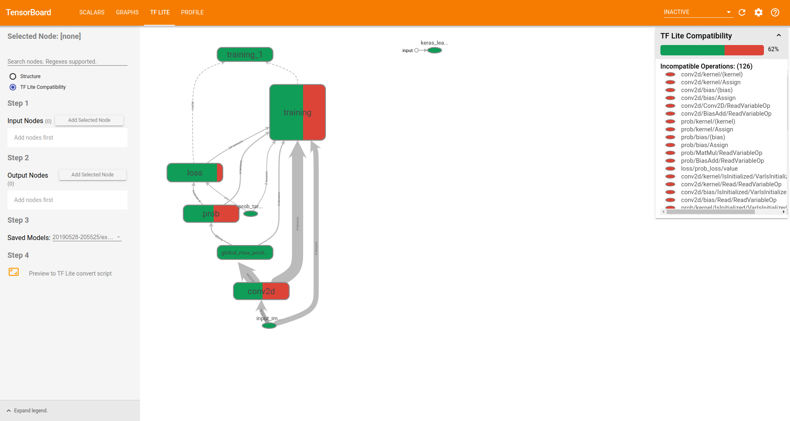

# The TensorFlow Lite Dashboard

This dashboard displays TensorFlow Lite compatibility in graph explorer,
developers are able to visually explore the graph and know ops compatibility.
It makes their life easier to convert a TF graph to TFLite, when specifying the
inputs and outputs.

Features:
  * Identify supported and unsupported ops with colors.
  * Calculate the coverage of compatible ops.
  * List incompatible operations. Click on an operation to zoom in on the selected
    op.
  * Select nodes and convert TensorFlow model into TF Lite.
