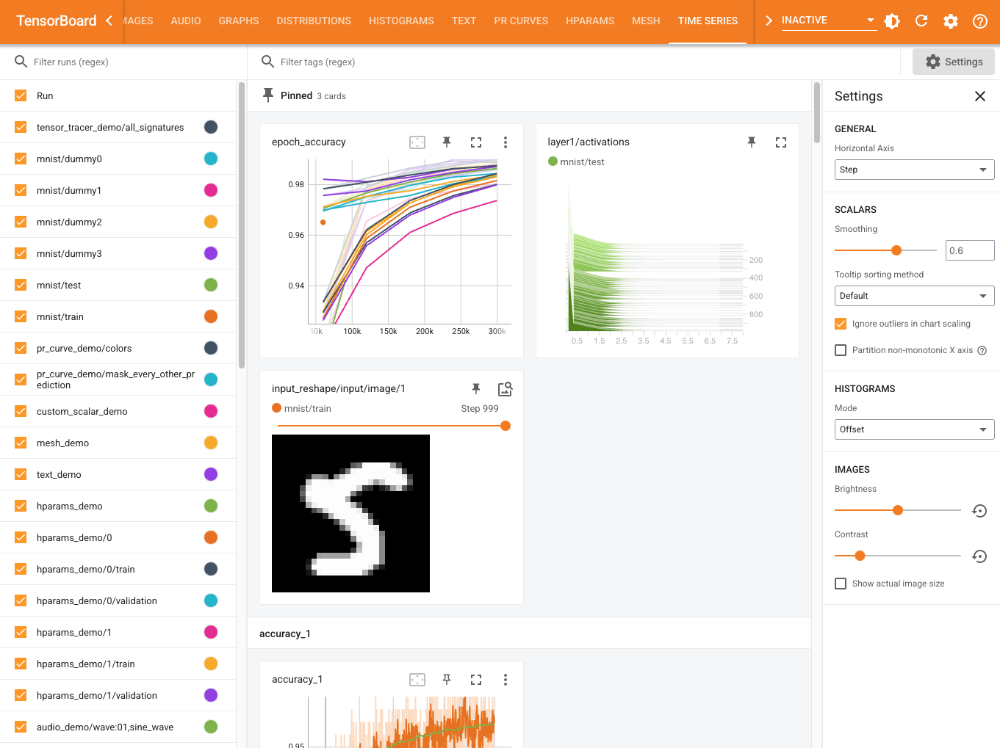

# Time Series dashboard

The Time Series Dashboard shows a unified interface containing all your Scalars,
Histograms, and Images saved via `tf.summary.scalar`, `tf.summary.image`, or
`tf.summary.histogram`. It enables viewing your 'accuracy' line chart side by
side with activation histograms and training example images, for example.

Features include:

* Custom run colors: click on the colored circles in the run selector to change
a run's color.

* Pinned cards: click the 'pin' icon on any card to add it to the pinned section
at the top for quick comparison.

* Settings: the right pane offers settings for charts and other visualizations.
Important settings will persist across TensorBoard sessions, when hosted at the
same URL origin.

* Autocomplete in tag filter: search for specific charts more easily.

## Implementation notes

### Backend

This dashboard relies on direct requests against the endpoints provided in
[plugins/metrics/](https://github.com/tensorflow/tensorboard/blob/449273b7c3124283c0837a2caa2f887b1dc6235f/tensorboard/plugins/metrics/).
See full details about the API in
[plugins/metrics/http_api.md](https://github.com/tensorflow/tensorboard/blob/449273b7c3124283c0837a2caa2f887b1dc6235f/tensorboard/plugins/metrics/http_api.md).
The backend types and endpoints are intended to fully match those specified in
TypeScript at
[webapp/metrics/data_source/metrics_backend_types.ts](https://github.com/tensorflow/tensorboard/blob/449273b7c3124283c0837a2caa2f887b1dc6235f/tensorboard/webapp/metrics/data_source/metrics_backend_types.ts).

### Frontend

Notably, the frontend is aware of a few concepts

* Experiment: the currently selected logdir of a TensorBoard instance represents
  a fixed scope of runs. In this sense, an 'experiment' represents the collection
  of all the runs in the logdir.
* RunId: users currently provide a run name during summary writing, for example
  'run_directory_1' in `tf.summary.create_file_writer('run_directory_1')`. To
  support a future with multiple experiments, the RunId concept is a unique
  identifier of a single run in a specific experiment. Multiple experiments can
  have a run with the same name 'run_directory_1', but each run will have its own
  RunId.
* Card: each rectangular item shown in the Time Series dashboard's main view.
* Sampled vs. Non-sampled plugins: some plugin types like images are written as
  summaries that contain multiple images at each step. For example,
  `tf.summary.image("eval_images", [image1, image2], step))` writes 2 image
  samples to the same run/tag/step. Non-sampled plugin types such as scalars, do
  not have the concept of a 'sample'.
* Single-run vs. Multi-run: this frontend concept describes whether a plugin
  type, e.g. images, shows 1 run's worth of data in a single card, or multiple
  runs' worth of data in a single card, e.g. scalars.

As of July 2021, the component hierarchy looks as follows:

