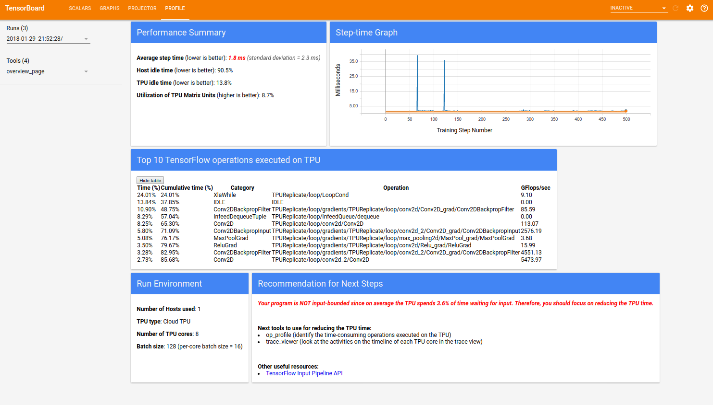
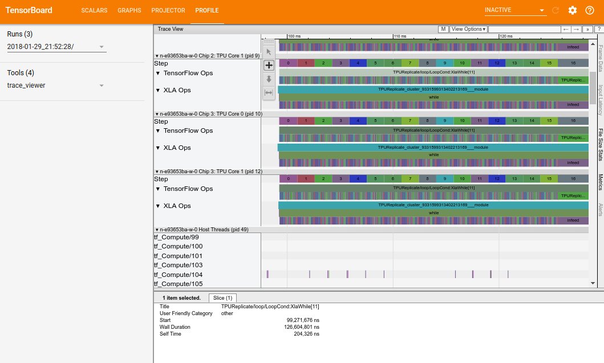
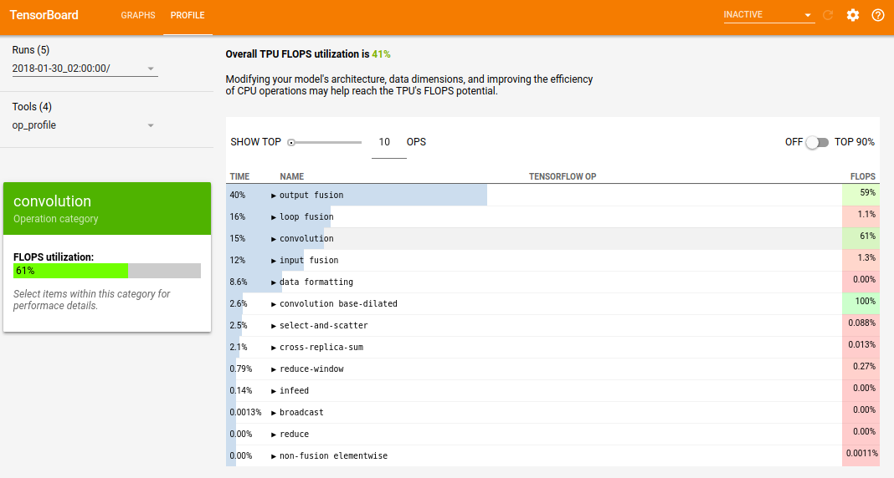
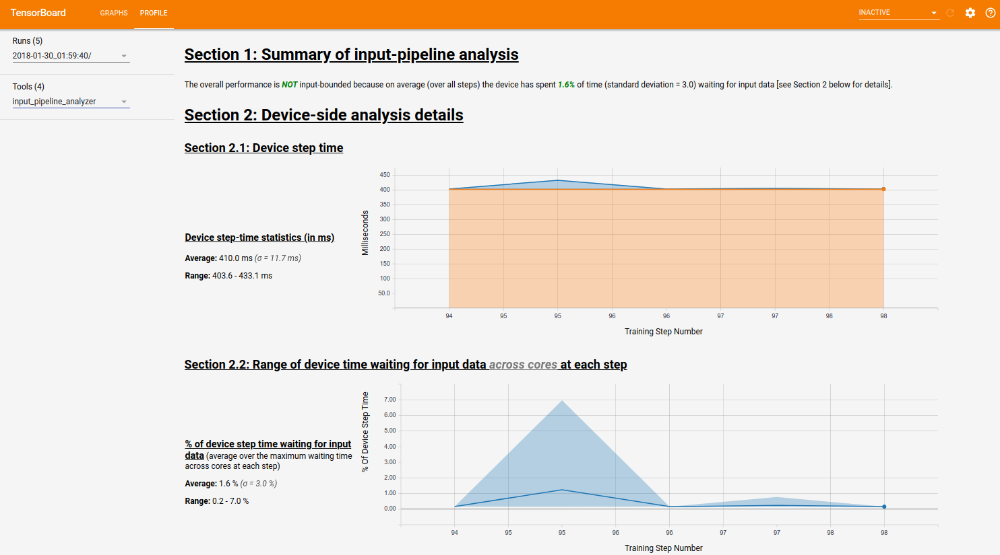
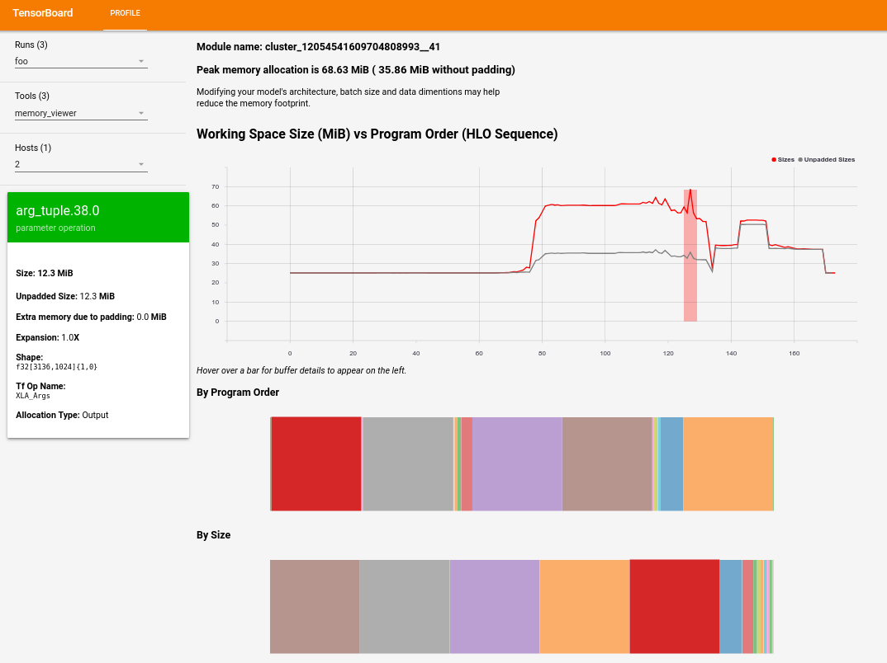

# The Profile Plugin Dashboard

The TensorBoard Profile Dashboard includes a suite of TPU tools. These
tools help you understand, debug and optimize TensorFlow programs to run on
TPUs.

## Prerequisites

Before you can use the tools in Profile Dashboard, you must have access to
Google Cloud TPUs. You also need to capture trace information while your model
is running.

## Overview Page

The Overview Page gives an overview of the performance of the workload
running on the TPU. It has five sections as shown in the following figure:

  * Performance Summary, which includes:

    - The step time averaged over all steps sampled
    - The percentage of Host time that is idle
    - The percentage of TPU time that is idle
    - The percentage utilization of the TPU matrix units

  * Step-time Graph, which plots a graph of step time (in milliseconds) over
  all the steps sampled.

  * Top 10 TensorFlow operations on TPU, which shows the TensorFlow operations
  executed on the TPU that consumes the majority of time.

  * Run Environment, which includes:

    - The number of hosts used
    - The type of TPU used
    - The number of TPU cores
    - The training batch size
    - Job information (both the build command and run command)

  * Recommendation for Next Steps, which first reports if the workload is
    input bounded. Then it suggests the next tools for reducing the bottleneck
    (depending on whether it is the input time, the TPU time, or both).

## Trace Viewer

Trace Viewer contains a timeline that shows various operations in your
TensorFlow model that the TPUs and host machine executed over time.

The Timeline pane contains the following elements:

  1. A top bar, which contains various auxiliary controls.
  1. A time axis, which shows time relative to the beginning of the trace.
  1. Section and track labels. Each section contains multiple tracks and
  has a triangle on the left that you can click to expand and collapse the
  section. There is one section for each TPU node and an additional section
  for threads running on the host machine's CPU, labeled "CPU Threads".
  1. A tool selector, which contains various tools for interacting with the
  Trace Viewer.
  1. Events. These show the time during which an operation was
  executed or the duration of meta-events, such as training steps.
  1. A vertical tab bar. This does not have a useful purpose for TPUs. It exists
  because Trace Viewer is a general purpose tool provided by Chrome that is used
  for a variety of performance analysis tasks. 

## Op Profile

Op Profile tool displays the performance statistics of
[XLA](https://www.tensorflow.org/performance/xla) operations executed during
the profiling period. Op Profile shows:

  * How your application uses the TPU. The TPU FLOPS utilization reported is
    defined as the measured number of floating point operations per second
    (FLOPS) over the peak FLOPS supported by the TPU.
  * The most time consuming operation.
  * Details of each op, including shape, XLA expression and padding.

## Input Pipeline Analyzer

Input pipeline analyzer tries to answer two questions:

  * Is your model input bound?
  * If it is, why?

The analysis contains three sections:
  * Summary, which tells you the overall input pipeline analysis: whether
  your application is input bound and by how much.
  * Device-side analysis, which shows you the detailed device-side analysis
  results, including the device step time and how much is spent waiting for
  the input data.
  * Host-side analysis, which shows you the detailed analysis on the host side,
  including a breakdown of input processing time on the host, and a tabular
  view of details for each input operation.

## Memory Viewer

Memory viewer tool allows you to visualize the peak memory usage for your
program, and how the memory usage trends over the program's lifetime.

### Top-Most Display
  * The top-most display shows how many memory usage trends over the program's
lifetime. The band drawn from top to buttom of the plot indicates the point
in the program with peak memory utilization.

  * Each point on the plot represents a "program point" in XLA's High Level
Optimizer (HLO) program, as it has been scheduled by the compiler.

### Below Displays
  * Below the top-most display are two displays that show the break-down of memory
usage at the peak usage program point (given by the band in the top-most plot).

  * The "By Program Order" display shows you the buffers in the order in which they
came to life during program execution. So if you're interested in which buffers
lived the longest, you would look at the left hand side of this display.

  * The "By Size" display shows you the buffers in the order of size, descending,
so you can see which buffers have the largest impact at the peak memory usage
point.

### Buffer Details Card and Lifetime Span
  * As you hover over the broken-down buffers in these displays, you can see the
HLO, size and other details that the buffer are associated with, as well as a
relative magnitude of the buffer size vs the peak on the plot, along with the
buffer's lifetime.
